# Local Image

**Retouch, cut out, composite and generate images on your own PC.**

Local Image is a desktop image workspace for Windows and Linux with **Retouch**, **Cutout** and **Image Gen** personas. Image editing and AI inference run locally through your own hardware and ComfyUI, without a cloud-model account or per-image API bill. Optional model downloads, stock search and live LoRA browsing use the internet.

[Windows preview](https://github.com/zdbosoxfan/local-image/releases/tag/v0.7.0) · [Linux preview](https://github.com/zdbosoxfan/local-image/releases/tag/v0.7.2-linux-preview) · [Linux installation](docs/LINUX-INSTALLATION.md) · [Windows installation](docs/INSTALLATION.md) · [Model guide](docs/GEN-MODELS.md)

**Personal project:** This is a **vibe-coded personal project**, shared as-is. There is **no guaranteed support and no guarantee of updates or improvements**.

**GPU requirement:** The AI features need a **capable NVIDIA CUDA GPU with enough VRAM for the selected model**. This project was tested on an **RTX 5090 with 32 GB VRAM**. The included presets have planning recommendations of roughly **16–32 GB VRAM**; larger images, multiple references and 4K enhancement can demand more memory. Manual editing and CPU Quick Heal remain available without a dedicated GPU. Check the [hardware guidance](#gpu-and-memory) before downloading models.

[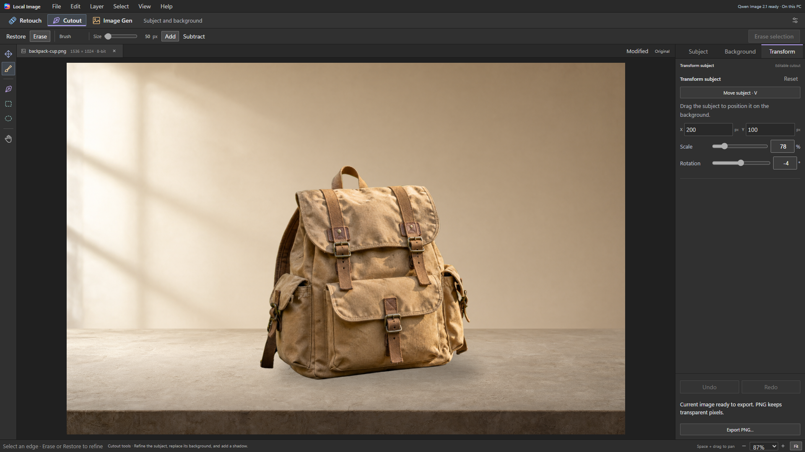](docs/images/ui/cutout-workspace.png)

*A real Qwen cutout and generated background, with subject position, scale, rotation and shadows still editable. Click any screenshot or example to view the original image.*

The interface uses conventional menus, contextual tools, tabbed Studio panels and a bottom filmstrip. One image keeps the filmstrip hidden; multiple images or an imported folder show it.

- **Retouch:** CPU Quick Heal and local AI object removal. Brush, pen and geometric selections; editable repair layers.
- **Cutout:** Qwen background removal, brush/pen refinement, subject movement, scaling and rotation, editable shadows and imported or generated backgrounds.
- **Image Gen:** text-to-image and model-specific image inputs, reference imports, repeatable seeds, dimensions and optional LoRAs. Generated results can continue into Retouch or Cutout, or become another document's background. Draft & Refine compares stages side by side, with a persistent image library and optional SeedVR2 enlargement.
- **Repeated work:** save a product treatment, prepare selected images one at a time, inspect the results and export unique copies. Each product retains its own cutout; originals and editor documents remain available.

## Inside the app

The screenshots below show the 0.7 interface and its completed workflows. The current `main` branch includes a newer workspace under active redesign; these captures do not represent its final layout.

### Brush to remove

Paint over a distraction, run **AI Remove**, and keep the repair on its own layer. The original stays protected, so you can compare, hide or discard the edit.

| 1. Brush over the unwanted mug | 2. Review the removal and its layer |
| --- | --- |
| [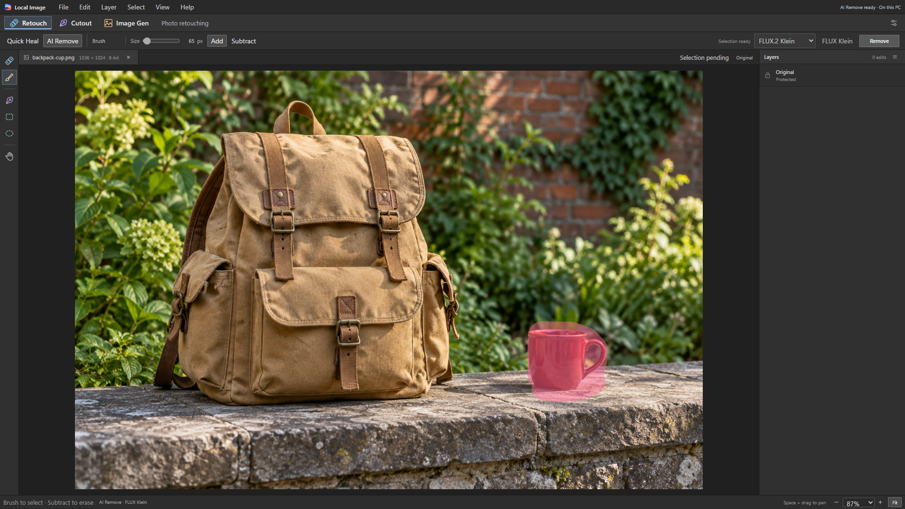](docs/images/ui/retouch-brush.png) | [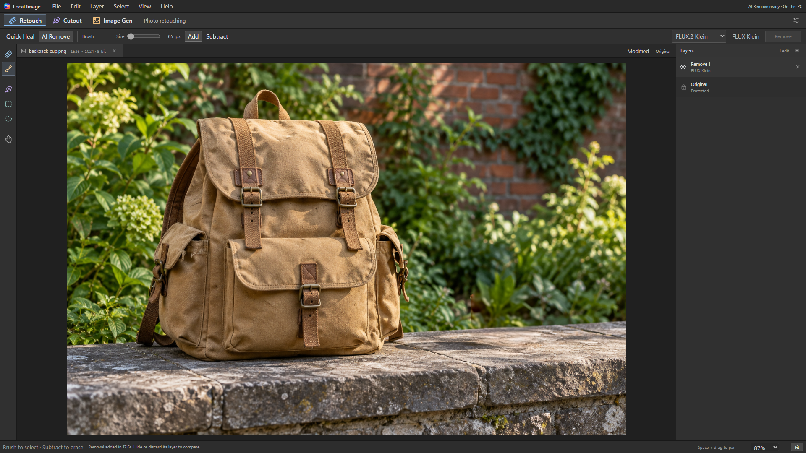](docs/images/ui/retouch-result-layers.png) |

This example used one actual local FLUX.2 Klein removal. The brush overlay is the app's real selection, and the second screenshot shows the completed edit.

View the original and exported result without the interface

| Original synthetic demo image | Actual exported removal |
| --- | --- |
| [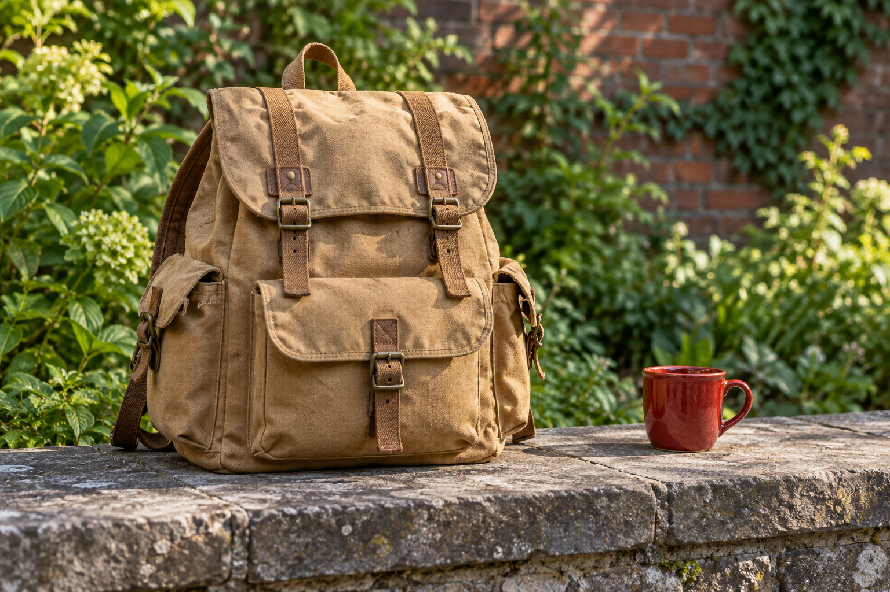](docs/images/examples/removal-before.png) | [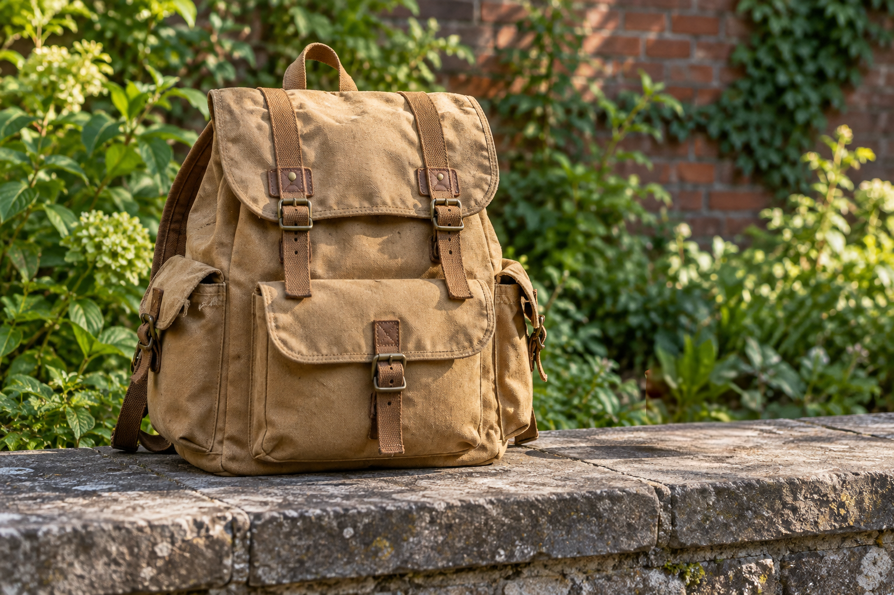](docs/images/examples/removal-after.png) |

### Layers and familiar commands

Edits remain visible in the Layers panel. Layer commands, project saves and export formats live in conventional menus, leaving the canvas free for the image.

[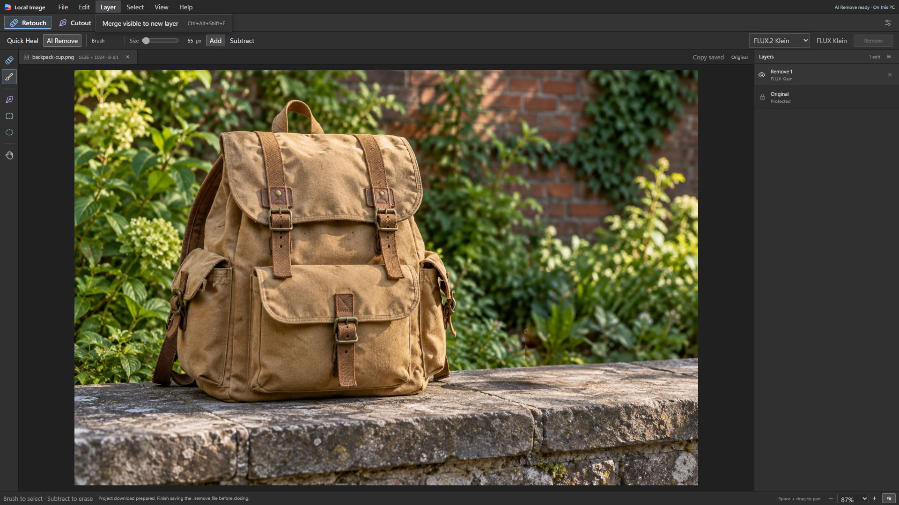](docs/images/ui/workspace-layers-menu.png)

See the File menu and export formats

[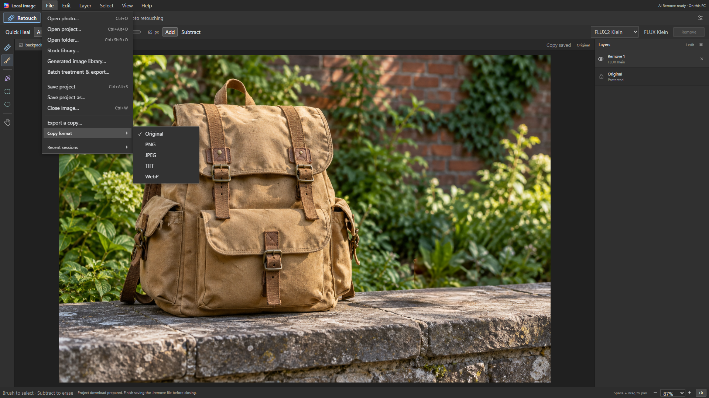](docs/images/ui/workspace-file-menu.png)

*The browser preview shown here disables native-only folder opening. The installed desktop app provides the Windows folder picker.*

### Find a background in the stock library

Search Openverse from the workspace, inspect a larger preview and its license, then open the image or use it as a background. Source and creator credits travel with imported images and editable projects.

[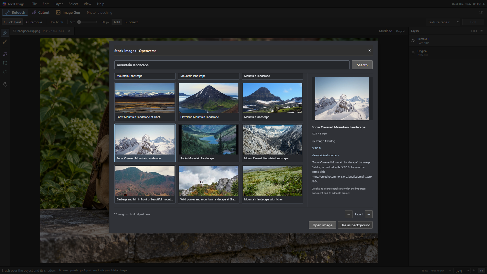](docs/images/ui/stock-library.png)

*This is a live search capture, with a CC0 image selected. Stock thumbnails retain their original licenses; [creators and source credits](docs/images/ui/STOCK-CREDITS.md) are included.*

### Image generation

Create an image from a prompt, import references, choose the model and sampling settings, then continue editing the result. **Draft & Refine** lets you use a fast model to explore ideas and a different model for the final pass.

[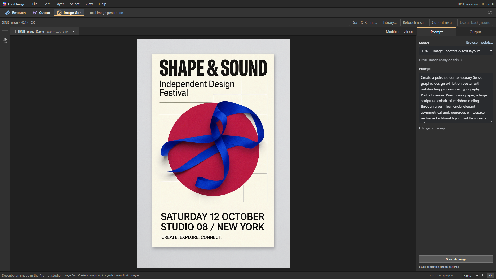](docs/images/ui/image-generation.png)

### A visual style library

Browse LoRAs by their image examples. The small **i** button opens usage, trigger phrases, recommended settings and compatibility details. Installed styles work offline; Browse retrieves current community results when requested.

[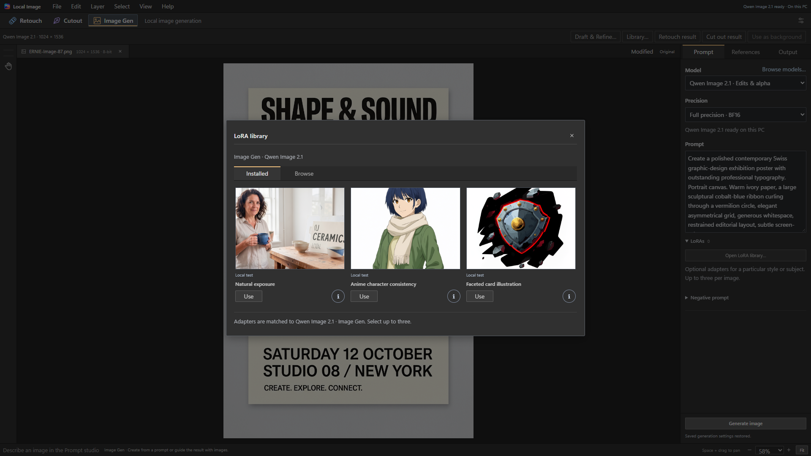](docs/images/ui/lora-library.png)

These are screenshots of the working 0.7 interface using real local model outputs, not interface mockups.

## Made locally

A few actual exports from the release test matrix. Each image links to its original PNG; exact prompts, seeds, steps, adapter strengths and checksums are recorded in the [example manifest](docs/images/examples/manifest.json).

| Transparent illustration | Photographic detail |
| --- | --- |
| [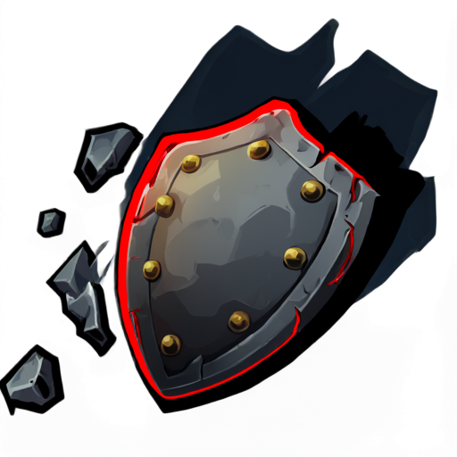](docs/images/examples/qwen-transparent-card.png) | [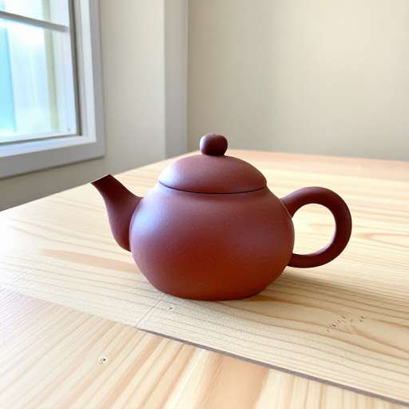](docs/images/examples/z-image-realism.png) |
| **Qwen Image 2.1 · INT8** — Faceted card illustration, native transparent PNG | **Z-Image Turbo** — Photographic realism, 8 steps |

| Watercolor | Clay miniature |
| --- | --- |
| [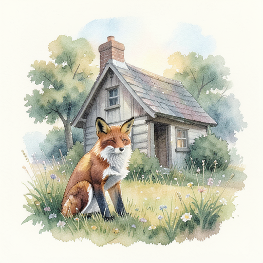](docs/images/examples/klein-watercolor.png) | [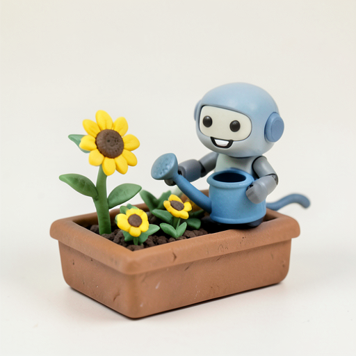](docs/images/examples/klein-clay.png) |
| **FLUX.2 Klein 4B** — Watercolor wash | **FLUX.2 Klein 4B** — Claymation miniature |

| Expressive illustration | Poster typography |
| --- | --- |
|  |  |
| **FLUX.2 Klein 9B · FP8** — Orange splatter illustration | **ERNIE-Image Base** — Local poster generation |

| Atmospheric illustration | Blueprint-inspired linework |
| --- | --- |
| [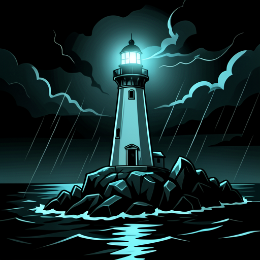](docs/images/examples/klein-teal-lighthouse.png) | [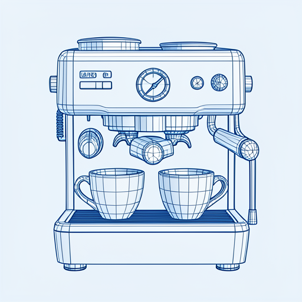](docs/images/examples/klein-blueprint-espresso.png) |
| **FLUX.2 Klein 9B** — Teal dark illustration | **FLUX.2 Klein 9B** — Blueprint wireframe, an illustration rather than an engineering drawing |

| Playful drawing | Reference-guided character edit |
| --- | --- |
| [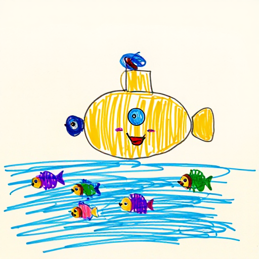](docs/images/examples/z-image-playful-submarine.png) | [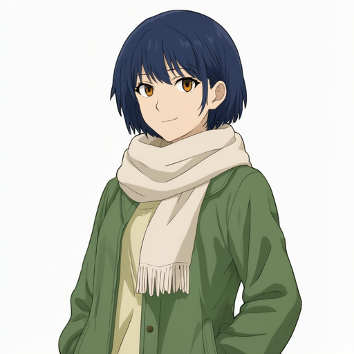](docs/images/examples/qwen-anime-reference.png) |
| **Z-Image Turbo** — Children's drawings | **Qwen Image 2.1 · INT8** — Anime character consistency |

The release run exercised **88 real cases and 440 exports**, including compatible curated LoRA combinations, transparency, reference edits, removal, compositing and UHD 4K enlargement. Artistic quality varies with the prompt and style mix; exact identity, geometry and lettering are not guaranteed. See the [validation report](docs/LOCAL-IMAGE-07-VALIDATION.md) for coverage and observed limitations.

## Models

| Model | Best suited to | Image inputs | Transparent generation |
| --- | --- | --- | --- |
| Qwen Image 2.1 | Edits and transparent assets | Up to 10 semantic references | Yes, native RGBA |
| Z-Image Turbo | Fast generation | One starting image for latent variations | No |
| FLUX.2 Klein 4B | Fast reference editing | Up to 4 semantic references | No |
| FLUX.2 Klein 9B | Larger reference-editing model | Up to 4 semantic references | No |
| ERNIE-Image Base | Text-heavy posters and graphic layouts | Text only | No |

Qwen offers Compact INT8 and Full BF16 presets of the same model. Klein 4B uses BF16; Klein 9B uses an FP8 preset. Model availability is checked against the running ComfyUI service. Klein 9B's publisher repository currently requires access approval; it remains listed in the model browser but cannot be downloaded anonymously. The UI shows only applicable inputs: for example, Z-Image Turbo exposes variation strength while Qwen exposes transparent output. LoRAs are optional and belong to a specific base model.

ERNIE reproduced all five requested strings in the local poster test, but still missed a no-mockup layout instruction. No model guarantees perfect text or layout. Qwen's opaque generation composites unexpected transparency over white; dedicated background generation rejects substantial transparency instead of accepting an incomplete scene.

## Install and start

### GPU and memory

| AI workload | App planning recommendation |
| --- | --- |
| Z-Image Turbo, FLUX.2 Klein 4B and Klein AI Remove | 16 GB VRAM |
| Qwen Compact INT8, Klein 9B and ERNIE-Image | 24 GB VRAM |
| Qwen Full BF16 and SeedVR2 4K enhancement | 32 GB VRAM |

These are planning figures for the included presets. Actual memory use depends on image size, reference count and ComfyUI offloading. Offloading needs system RAM and can make generation substantially slower. The current validation machine has a 32 GB NVIDIA GPU; lower-memory systems and other GPU platforms are not guaranteed. Model files also require substantial disk space. See [installation and AI setup](docs/INSTALLATION.md#start-with-cpu-tools-or-connect-ai) for the supported runtime.

### Download

**Linux x86-64:** download the Ubuntu `.deb` or the per-user `.tar.gz` archive from the [0.7.1 Linux preview release](https://github.com/zdbosoxfan/local-image/releases/tag/v0.7.2-linux-preview). On Ubuntu, open the `.deb` with the system package installer. On Fedora or another compatible desktop, extract the archive and run `./install.sh` from its folder. Both add **Local Image** to the application menu and include Python, Qt and the editor; installing Python or Node.js is unnecessary. This preview targets Ubuntu 24.04/glibc 2.39 and Fedora 44. Follow the [Linux installation guide](docs/LINUX-INSTALLATION.md) for exact requirements, storage, upgrades and optional AI setup.

**Windows x64:**
[Download Local Image 0.7 for Windows x64](https://github.com/zdbosoxfan/local-image/releases/download/v0.7.0/Local-Image-Setup-0.7.0.exe), or see the [release page and checksum](https://github.com/zdbosoxfan/local-image/releases/tag/v0.7.0). Choose installation for all users in **Program Files**, or for the current user in **AppData**, and change the application folder if needed. Optional folder choices reserve a location for model downloads and the dedicated portable ComfyUI runtime. Settings, browser data, recovery and caches belong to each Windows user's AppData. See [the installation guide](docs/INSTALLATION.md) for storage, upgrades and setup on a new PC, or [build from source](docs/DEVELOPMENT.md).

Both packages include the app and Python backend. Windows uses a native WebView2 host; Linux uses a native Qt window with a bundled rendering engine and persistent app storage. ComfyUI and model weights are separate optional downloads. In **Edit > Settings > Local AI**, detect or browse for an existing ComfyUI installation, choose model storage, and download supported model presets. Windows also offers a dedicated portable ComfyUI runtime; on Linux, connect an existing Linux ComfyUI installation. **Image Gen > Browse models…** compares strengths, precision, download sizes and GPU memory recommendations. Downloads verify publisher revisions, byte sizes and SHA-256 checksums.

Image Gen's **Output** tab exposes resolution and steps together, with a suggested step count for the chosen model. Optional guidance is under **Advanced sampling**. See the [Image Gen user guide](docs/IMAGE-GENERATION.md) for references, adapters, the two-pane Draft & Refine workspace, and optional SeedVR2 upscaling.

SeedVR2 is a separate optional photo enhancer. Its real 3840 x 2160 test improved apparent detail over Lanczos, but synthesized fine textures and slightly outlined lettering. Review results at full size; transparent output retains the resized source alpha rather than repairing its edges.

The first launch offers **Repair a photo**, **Remove a background**, **Create an image** and **Set up AI**, with detected GPU memory and expandable planning guidance. Open **Help > Hardware guide** to see it again. CPU editing and Quick Heal do not require a dedicated GPU. Model file sizes describe disk storage, not VRAM. ComfyUI can offload to system RAM, with a speed cost; large canvases and many references increase memory use. **Edit > Settings > Interface size** offers Compact, Comfortable and Large, with 200% text in the Large option.

Fresh Windows profiles use `%LOCALAPPDATA%\Local Image`. An existing `%LOCALAPPDATA%\Local Remove` profile is retained so upgrades preserve settings, recovery sessions, model paths and editable projects. Linux uses `$XDG_DATA_HOME/local-image`, normally `~/.local/share/local-image`. The `.lremove` project format and internal loopback endpoint `http://127.0.0.1:51247/remove` remain compatible. Normal editing runs without administrator rights. Desktop processes use Local Image names (`local-image` and `LocalImageBackend` on Linux). Legacy storage, installer and project identifiers remain compatible so updates preserve existing data.

## Workspaces and guides

- [Cutout editing and compositing](docs/CUTOUT-WORKSPACE.md)
- [Product treatments and reviewed batch export](docs/BATCH-WORKSPACE.md)
- [Installation, AI setup and storage on another PC](docs/INSTALLATION.md)
- [Linux installation, updates and optional AI](docs/LINUX-INSTALLATION.md)
- [Image generation models and input behavior](docs/GEN-MODELS.md)
- [Generated-image library](docs/GENERATION-LIBRARY.md)
- [Ten reviewed styles and the live LoRA browser](docs/LORA-LIBRARY.md)
- [SeedVR2 upscaling and measured quality limits](docs/SEEDVR2.md)
- [ERNIE poster preset and exact-text evaluation](docs/ERNIE-IMAGE.md)
- [Stock image search, import and attribution](docs/STOCK-LIBRARY.md)
- [Interface references and design decisions](docs/WORKSPACE-REFERENCES.md)
- [Qwen integration details](docs/QWEN-IMAGE-21.md)
- [Build and test instructions](docs/DEVELOPMENT.md)
- [Earlier 0.4.0 cutout validation](docs/QWEN-VALIDATION.md)
- [0.6.0 installation and deployment validation](docs/INSTALLATION-VALIDATION.md)
- [0.7.0 usability, gallery and packaged validation](docs/LOCAL-IMAGE-07-VALIDATION.md)
- [0.5.0 model-quality findings and GPU validation](docs/LOCAL-IMAGE-VALIDATION.md)

Transparent PNG, WebP and RGBA TIFF exports preserve alpha. TIFF editing retains native 16-bit source precision. Projects retain original pixels, repair layers, cutout masks, backgrounds, shadows, transforms and generation parameters. The generated image is portable; model weights and LoRA files are separate dependencies for regenerating it.

The LoRA library leads with image examples and a short name. The small **i** button opens usage, triggers, compatibility and publisher/license details. Local test examples are distinguished from publisher examples, which do not establish compatibility. The live browser queries Hugging Face when searched or refreshed. Ten exact-family starting points passed the earlier local GPU loading and visual review: three Qwen, two Z, two Klein 4B and three Klein 9B styles. Curated recommendations and unverified community results are labeled separately. The browser only downloads selected Safetensors files and does not install Python code or custom nodes.

**File > Stock library…** searches Openverse inside the app. Preview images and review their source and license, then open an image, use it as a cutout background, or add it as a generation reference. Imported credits stay with editable projects and are available through **File > Image credits…**, including **Copy credits** and **Save credits .txt** for sharing. Pexels and Unsplash remain clearly labeled external website links followed by local import. Compositor is a visual/workflow reference for this release; no Compositor code is integrated.

## Model licenses

Qwen Image 2.1 uses the [Qwen Research License](https://github.com/QwenLM/Qwen-Image-2.1/blob/main/LICENSE). FLUX.2 Klein 9B uses a [noncommercial model license](https://huggingface.co/black-forest-labs/FLUX.2-klein-9B/blob/main/LICENSE.md). Z-Image Turbo, FLUX.2 Klein 4B, ERNIE-Image and SeedVR2 are Apache 2.0. Separate LoRAs and stock images have their own licenses. The installer does not bundle model weights or grant additional model rights.
