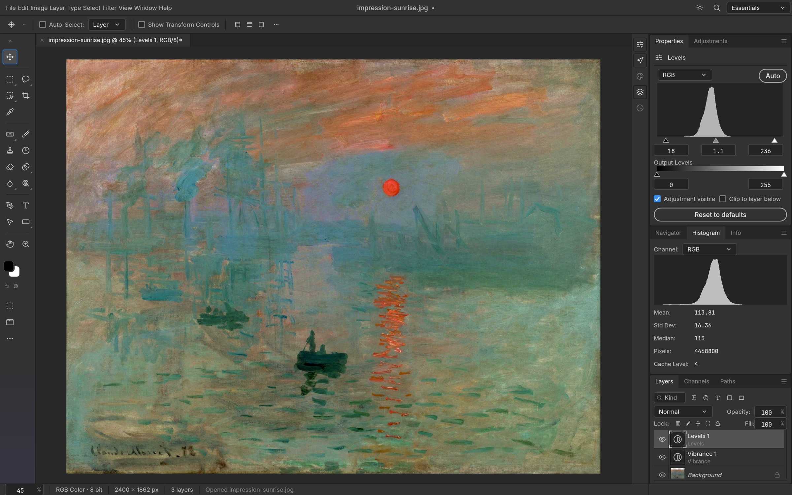
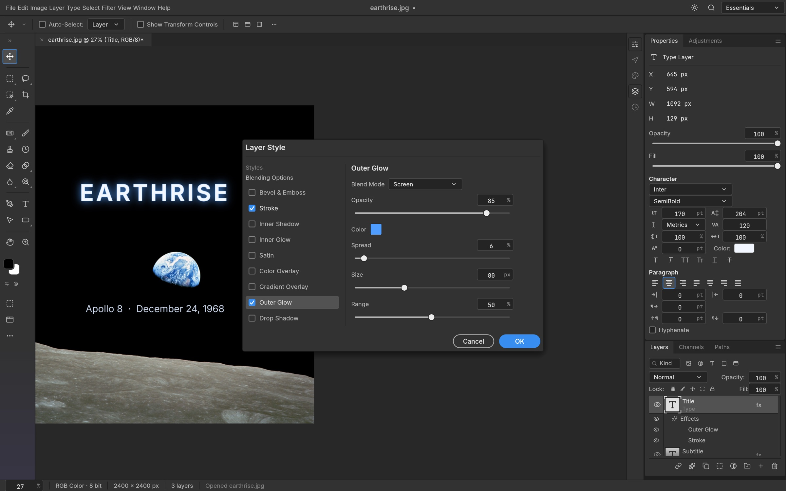
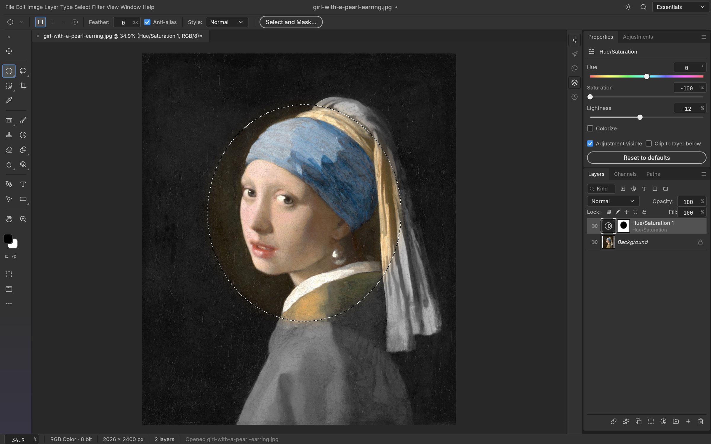
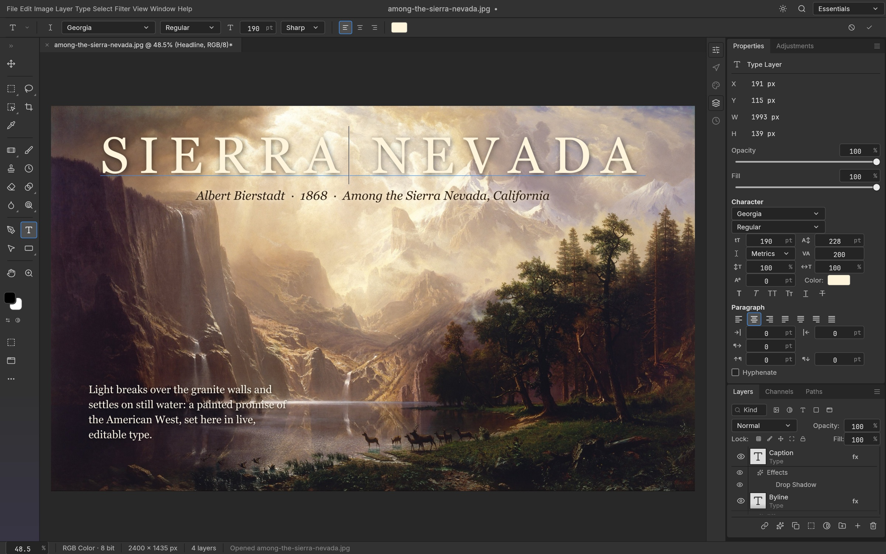
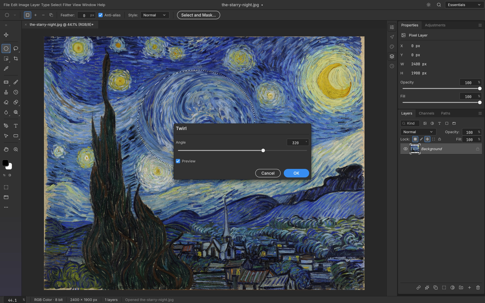
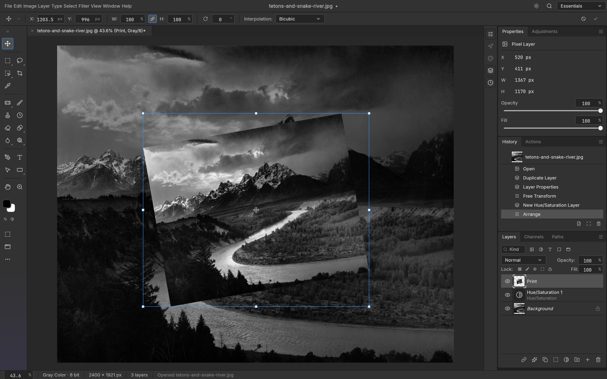
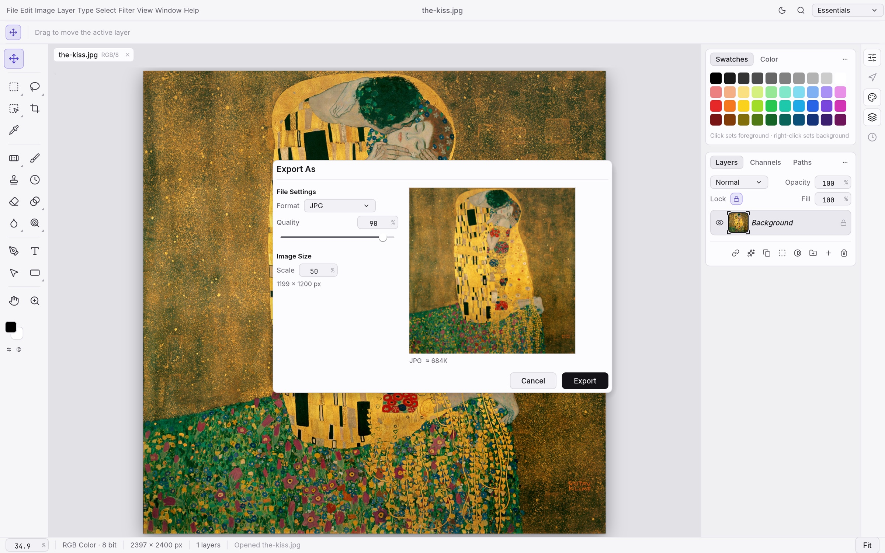

<p align="center">
  <a href="https://getartcraft.com/">
    <picture>
      <source media="(prefers-color-scheme: dark)" srcset="docs/brand/artcraft-logo-white.svg">
      
    </picture>
  </a>
</p>

<h1 align="center">PhotoCraft</h1>

<p align="center">
  <b>Image editing; an open-source, clean-room reimplementation of Adobe Photoshop, rebuilt in pure Rust.</b><br>
  Layers, masks, adjustment layers, layer styles, type, vectors, brushes and real PSD files,<br>
  in a native app written entirely in Rust. Open source, offline, and yours.
</p>

<p align="center">
  
  
  
  
</p>

<p align="center">
  <a href="https://discord.gg/artcraft"></a>
</p>

<p align="center">
  <a href="https://getartcraft.com/apps/photocraft"><b>PhotoCraft on getartcraft.com</b></a> ·
  <a href="https://getartcraft.com/">ArtCraft</a> ·
  <a href="https://getartcraft.com/apps">All Crafting Apps</a>
</p>

<br>

<p align="center">
  
  <br>
  <sub>A caption card with a drop shadow, live type, and Vibrance and Curves adjustment layers, with the Curves editor open.<br>
  <i>The Great Wave off Kanagawa</i>, Katsushika Hokusai, c. 1831</sub>
</p>

> [!NOTE]
> **ArtCraft is a community of artists from all walks of life.** Digital, generative, music,
> games &mdash; if you make things, you're one of us. **[Come say hi on Discord](https://discord.gg/artcraft).**

<p align="center">
  <a href="#features">Features</a> ·
  <a href="#everything-in-the-box">Everything in the box</a> ·
  <a href="#psd-without-compromise">PSD</a> ·
  <a href="#built-for-agents">Agents</a> ·
  <a href="#under-the-hood">Under the hood</a> ·
  <a href="#get-started">Get started</a> ·
  <a href="#downloads">Downloads</a> ·
  <a href="#the-crafting-apps">Crafting Apps</a> ·
  <a href="https://discord.gg/artcraft">Discord</a>
</p>

<br>

<table>
  <tr>
    <td width="25%" valign="top">
      <h3>🎛️ Familiar by design</h3>
      The menus, shortcuts, panels and tools are where your hands expect them, from ⌘J to ⇧⌘D. If you know Photoshop, you already know PhotoCraft.
    </td>
    <td width="25%" valign="top">
      <h3>⚡ Native and fast</h3>
      A GPU compositor on wgpu (Metal, Vulkan, DX12, WebGPU), copy-on-write tiles and multithreaded filters. No Electron, no web view, no waiting.
    </td>
    <td width="25%" valign="top">
      <h3>🗂️ Real PSD files</h3>
      Open, edit and save layered Photoshop documents. Re-saving keeps the render of 307 of the 309 psd-tools test files.
    </td>
    <td width="25%" valign="top">
      <h3>🤖 Agent-ready</h3>
      Every action is a command, so you can drive the same engine from the UI, the CLI, a JSON control channel or an MCP server.
    </td>
  </tr>
</table>

<br>

## Features

Every screenshot here is the real app at work on public-domain art, rendered offscreen through its control channel.

<table>
  <tr>
    <td width="50%" valign="top">
      
      <br>
      <sub>Levels and Vibrance adjustment layers, with the live Histogram panel.<br><i>Impression, Sunrise</i>, Claude Monet, 1872</sub>
      <h3>Edit without regret</h3>
      Adjustment layers keep every edit live. Stack Levels, Curves, Vibrance, Hue/Saturation and a dozen more, mask them to an area, reorder them, or turn them off, and your original pixels never change.
      <br><br>
      <b>16 adjustment layers</b> that also apply directly to pixels, including Curves with per-channel editing, Levels with a live histogram, Black &amp; White, Channel Mixer, Gradient Map, Photo Filter, Selective Color and Color Lookup (.cube, .3dl, .look). Plus Shadows/Highlights, Replace Color, Match Color, HDR Toning, Desaturate and Equalize.
    </td>
    <td width="50%" valign="top">
      
      <br>
      <sub>Outer Glow and Stroke on a live type layer, in the Layer Style dialog.<br><i>Earthrise</i>, William Anders / NASA, 1968</sub>
      <h3>Styles that sell the shot</h3>
      Drop Shadow, Inner Shadow, Outer and Inner Glow, Bevel &amp; Emboss, Satin, Stroke, and Color, Gradient and Pattern Overlay, live on any layer, including type. Patterns come from a library (built-ins, Edit › Define Pattern, <code>.pat</code> import/export) and PSD <code>Patt</code> blocks.
      <br><br>
      Copy and paste styles between layers, hide all effects at once, and open styles straight from your PSDs, rendered to match Photoshop.
    </td>
  </tr>
  <tr>
    <td width="50%" valign="top">
      
      <br>
      <sub>An elliptical selection becomes the mask of a Hue/Saturation layer, so only the face keeps its color.<br><i>Girl with a Pearl Earring</i>, Johannes Vermeer, c. 1665</sub>
      <h3>Selections that understand your image</h3>
      Marquees, lassos and the Magic Wand for precision; Quick Selection, Object Selection and Select Subject when you want the computer to do the tracing; Select and Mask to refine hair-fine edges.
      <br><br>
      Feather, expand, contract, smooth, grow, reselect. Turn any selection into a layer mask, a vector path or a shape. Smart selection runs on your machine, with no cloud and no account.
    </td>
    <td width="50%" valign="top">
      
      <br>
      <sub>A headline edited in place, with a byline and a paragraph of body text.<br><i>Among the Sierra Nevada, California</i>, Albert Bierstadt, 1868</sub>
      <h3>Type that sets beautifully</h3>
      Point and paragraph text, edited right on the canvas, with full Character and Paragraph controls: font, weight, size, leading, tracking, alignment and colour.
      <br><br>
      Type layers stay editable, take layer styles, and round-trip through PSD.
    </td>
  </tr>
  <tr>
    <td width="50%" valign="top">
      
      <br>
      <sub>A badge made of shape layers: a gradient-filled lotus, a star and a dotted ring.<br><i>Water Lilies</i>, Claude Monet, 1906</sub>
      <h3>Pixel-perfect vectors</h3>
      Rectangle, Ellipse, Triangle, Polygon, Line and the Pen tool, with resolution-independent shape layers, gradient fills, and dashed, aligned strokes.
      <br><br>
      Combine shapes (unite, subtract, intersect, exclude), keep paths in the Paths panel, use them as vector masks, or stroke and fill them. 116 of 116 shape layers in our PSD corpus match Photoshop's pixels.
    </td>
    <td width="50%" valign="top">
      
      <br>
      <sub>Twirl previews live on the canvas, only inside the selection.<br><i>The Starry Night</i>, Vincent van Gogh, 1889</sub>
      <h3>See it before you commit</h3>
      Every filter dialog previews live on the canvas, through your selection. Blurs (Gaussian, Box, Motion, Radial, Surface, Smart, Lens, Shape, and the Blur Gallery: Tilt-Shift, Iris, Field, Spin, Path), sharpening, Reduce Noise, distortions (Twirl, Wave, Ripple, Displace, Shear, Zig Zag…), Pixelate, Stylize (Oil Paint, Wind, Extrude…), Render (Clouds, Fibers, Lens Flare, Lighting Effects) and more.
      <br><br>
      Run filters on a smart object and they stay editable: change, hide, reorder or mask them at any time.
      <br><br>
      Large-radius blurs use running-sum box passes across all cores: a radius-180 Gaussian on 3.6 MP takes under a second.
    </td>
  </tr>
  <tr>
    <td width="50%" valign="top">
      
      <br>
      <sub>Free Transform on a rotated print, with every step listed in History.<br><i>The Tetons and the Snake River</i>, Ansel Adams, 1942</sub>
      <h3>Shape it any way you like</h3>
      Free Transform with scale, rotate, skew, distort and perspective; exact 90° and 180° rotations and flips; Transform Again. Layers, type, shapes, masks and selections all transform together.
      <br><br>
      Full history, Toggle Last State and the History Brush mean every step can be undone, even one brush stroke at a time.
    </td>
    <td width="50%" valign="top">
      
      <br>
      <sub>Export As in the light theme, with a preview and a file-size estimate.<br><i>The Kiss</i>, Gustav Klimt, 1907–1908</sub>
      <h3>Ship it anywhere</h3>
      Export As with format, quality, transparency and scale, plus a preview and an instant file-size estimate. Quick Export to PNG in one click.
      <br><br>
      Choose a dark Pro theme, the airy Studio themes, or a Classic look.
    </td>
  </tr>
</table>

<br>

## Everything in the box

<table>
  <tr>
    <td width="33%" valign="top">
      <h4>🧰 34 tools</h4>
      Move · Rectangular and Elliptical Marquee · Lasso · Polygonal Lasso · Magnetic Lasso · Magic Wand · Quick Selection · Object Selection · Crop · Eyedropper · Brush · Pencil · Mixer Brush · Color Replacement · Eraser · Clone Stamp · Healing Brush · Spot Healing · History Brush · Gradient · Paint Bucket · Blur · Sharpen · Smudge · Dodge · Burn · Sponge · Pen · Path Selection · Type · five Shape tools · Hand · Zoom
    </td>
    <td width="33%" valign="top">
      <h4>🖌️ A real brush engine</h4>
      Shape Dynamics, Scattering, Texture, Dual Brush, Color Dynamics, Transfer, Brush Pose, Wet Edges, Build-up and Smoothing (including Pulled String), driven by pen pressure, tilt, rotation and direction. Brush presets, Define Brush from Selection, and deterministic, replayable strokes.
    </td>
    <td width="33%" valign="top">
      <h4>🗃️ Layers, done properly</h4>
      Groups, clipping masks, pixel and vector masks, fill layers (solid, gradient and pattern), adjustment layers, live smart objects with smart filters and lossless transforms and warps, multi-layer selection with align, distribute and link, alpha channels and Quick Mask, 27 blend modes, opacity and fill, locks, colour labels, layer filters, merge, flatten, rasterize, Layer via Copy/Cut, Paste Into.
    </td>
  </tr>
  <tr>
    <td width="33%" valign="top">
      <h4>🎨 Any colour, any depth</h4>
      RGB, Grayscale, CMYK and Lab documents at 8, 16 and 32 bits per channel. Bit depth and colour model are runtime data, so every tool works at every depth.
      <br><br>
      Real ICC colour management in pure Rust: embedded profiles, Assign and Convert to Profile with all four rendering intents and black point compensation, soft proofing (⌘Y) and Gamut Warning (⇧⌘Y) on the GPU.
    </td>
    <td width="33%" valign="top">
      <h4>🗂️ Formats</h4>
      PSD and PSB, layered TIFF (Photoshop's layer data in the TIFF, read and written in either byte order), plus flat PNG, JPEG, TIFF, WebP (lossy and lossless), GIF, BMP, TGA, ICO, QOI, PNM, OpenEXR, Radiance HDR and AVIF, with symmetric read and write at 8, 16 and 32 bits, HEIC photos from iPhone and Mac (read; in official builds, an optional <code>--features heif</code> build feature), and the native <code>.pcraft</code> format.
    </td>
    <td width="33%" valign="top">
      <h4>🪄 The everyday essentials</h4>
      Auto Tone, Contrast and Color · Equalize · Image and Canvas Size · Crop and Trim · Reveal All · Edit › Fill and Stroke · Copy Merged · Paste in Place · guides, rulers, grid and snapping · Actions record and replay · a command palette (⌘K).
    </td>
  </tr>
</table>

<br>

## PSD without compromise

PhotoCraft's PSD support is a standalone crate written from Adobe's public specification and tested against a corpus of real-world files.

- **Faithful round trips:** opening and re-saving a document renders the same for 307 of the 309 files in the psd-tools test set and 169 of 170 in our mixed ag-psd/psd-tools set (`crates/io/tests/corpus.rs`; fetch the psd-tools set with `cargo xtask corpus --psd-tools`), and anything we don't model yet (raw blocks, descriptors, extras) is carried over instead of being dropped. A re-saved file is not byte-identical to its source: PhotoCraft rewrites image resources, layer records and the composite. Only the standalone `photocraft-psd` crate, parsing and writing a file without the document model, reproduces every parseable corpus file byte for byte (`crates/psd/tests/corpus.rs`).
- **Pixels that match:** a composite oracle compares our render with Photoshop's own merged image, covering gradient interpolation (Classic, Perceptual and Linear), layer effects, shape strokes, clipping and fill opacity.
- **Large documents:** PSB, 16 and 32-bit files, and CMYK and Lab documents open natively.

## Built for agents

Every menu item, tool and dialog runs a command from one registry of 500+ commands. The UI, the CLI, the JSON control channel and the MCP server all call the same commands, so anything you can click, a script or an AI agent can do too.

```sh
# Headless: open, edit, save
photocraft-cli run wave.psd \
  --cmd filter.sharpen.smartSharpen     --params '{"amount":80}' \
  --cmd layer.newAdjustmentLayer.curves --params '{"points":[[0,0],[64,48],[192,212],[255,255]]}' \
  --out wave-final.png

# Apply one action list to a folder of images
photocraft-cli batch --actions grade.json --in ./raw --out ./graded

# Every subcommand explains itself
photocraft-cli batch --help

# Let an agent drive it over MCP (headless, or bridged to the running app)
photocraft-cli mcp
```

The desktop app also offers an authenticated, loopback-only control channel (`photocraft --control`) for inspecting UI state, driving tools with pointer events, and taking offscreen screenshots. Every image in this README was rendered that way. See [`docs/control-protocol.md`](docs/control-protocol.md).

## Under the hood

- **Engine first:** a pure-data document model and a command engine, with a thin egui UI on top. Layering is enforced at build time across 24 crates.
- **Two compositors:** a CPU compositor serves as the reference oracle, and a wgpu compositor puts the canvas on the GPU. They are tested against each other.
- **Copy-on-write tiles:** 256² sparse tiles make undo cheap and huge canvases light, and effect maps are cached per layer state.
- **Runs in the browser:** the whole engine and UI compile to WebAssembly.
- **Clean-room:** implemented from public specs and observed behaviour only. No proprietary code, shaders or assets.
- **Tested:** more than 1,700 tests, including PSD round trips, synthetic generators, compositor oracles and multi-depth checks.

## Get started

```sh
git clone https://github.com/storytold/photocraft
cd photocraft
cargo run --release -p photocraft -- image.psd   # the desktop app
cargo test --workspace                           # the test suite
```

Japanese fonts for the UI and Type tool come from [craft-fonts](https://github.com/storytold/craft-fonts), an optional build input (desktop release builds always include it). Without it PhotoCraft uses your system's CJK fonts:

```sh
git clone https://github.com/storytold/craft-fonts ../craft-fonts
CRAFT_FONTS_DIR="$PWD/../craft-fonts" cargo run --release -p photocraft
```

New contributors and AI agents: start with [`AGENTS.md`](AGENTS.md), then [`docs/`](docs/).

Installers for macOS, Windows, Linux, FreeBSD and the web are attached to each [GitHub release](https://github.com/storytold/photocraft/releases). On Linux you can pick an AppImage, a `.deb`, an `.rpm`, a tarball or a Flatpak bundle. The bundle needs the freedesktop runtime from [Flathub](https://flathub.org/setup), which `flatpak` offers to install along with it:

```sh
flatpak install --user photocraft-<version>-linux-x86_64.flatpak   # or -linux-aarch64
flatpak run ai.storyteller.photocraft
```

The AppImage needs no install: the first run registers its launcher icon and menu entry in `~/.local/share` so the dock shows PhotoCraft's icon on Wayland. Set `PHOTOCRAFT_NO_DESKTOP_INTEGRATION=1` to skip that, and see [`docs/releasing.md`](docs/releasing.md) › Linux to undo it.

On macOS, the command-line tool comes as `photocraft-cli-<version>-macos-universal.zip`. The binary is signed with the same Developer ID as the app and notarized by Apple. A bare binary can't carry a stapled notarization ticket the way the DMG does, so the first time you run it macOS checks the notarization online. You can confirm it yourself:

```sh
ditto -x -k photocraft-cli-<version>-macos-universal.zip .
spctl --assess --type install -vv photocraft-cli-<version>-macos-universal/photocraft-cli
# ... accepted, source=Notarized Developer ID
```

On FreeBSD 14 (x86_64), the release has a tarball laid out like `/usr/local`. Install the runtime libraries, then unpack it there:

```sh
pkg install libxkbcommon wayland libX11 libXcursor libXrandr libXi libxcb mesa-libs vulkan-loader gtk3 fontconfig freetype2 alsa-lib
tar -xzf photocraft-<version>-freebsd-x86_64.tar.gz --strip-components 1 -C /usr/local
photocraft
```

Maintainers: [`docs/releasing.md`](docs/releasing.md) explains how releases are built, signed and published.

> [!IMPORTANT]
> **Status:** PhotoCraft is in early alpha, and we want to be straight about where it stands: much of Photoshop's feature surface exists in some form, but **it is not yet a Photoshop replacement for daily professional work**. The biggest gaps are AI/generative features, about twenty missing tools, depth in typography and pro workflows, and plug-in compatibility. Every Photoshop menu item is wired to a command ([`docs/parity.md`](docs/parity.md)), but that measures wiring, not behaviour. The honest, dimension-by-dimension picture and where we're going next are in the [roadmap's parity assessment](docs/roadmap.md#honest-parity-assessment-2026-10-05). Expect rough edges, and please file issues (include your OS, document size, layer count and a screenshot). You can also tell us what broke on [Discord](https://discord.gg/artcraft).

## Documentation

Developer, architecture, automation, format, and security documentation is maintained in the [PhotoCraft documentation book](book/).

## Security

Security architecture, threat modeling, parser hardening, fuzzing, and vulnerability reporting are covered in the [security documentation](book/src/security/) and the repository [security policy](SECURITY.md).

## Test corpora

PhotoCraft is tested against real files: our own Photoshop-authored oracle PSDs in
[photocraft-corpus](https://github.com/storytold/photocraft-corpus) plus the psd-tools, ag-psd and PngSuite sets, pinned and
sha256-verified. Fetch them with `cargo xtask corpus --all` and run the tests with
`cargo xtask test-corpus` (details in [docs/development.md](docs/development.md#test-corpora)).

## Downloads

Every [release](https://github.com/storytold/photocraft/releases/latest) ships these builds. `<ver>` is the
version number; `SHA256SUMS.txt` lists a checksum for every file.

### macOS

| Build | File | Notes |
|---|---|---|
| App, universal (Apple silicon + Intel) | `photocraft-<ver>-macos-universal.dmg` | Signed and notarized |
| Command-line tool, universal | `photocraft-cli-<ver>-macos-universal.zip` | Signed and notarized |

### Windows

| Build | Installer | Portable |
|---|---|---|
| x64 (64-bit Intel/AMD) | `photocraft-<ver>-windows-x64.msi` | `photocraft-<ver>-windows-x64-portable.zip` |
| arm64 (Snapdragon and other ARM PCs) | `photocraft-<ver>-windows-arm64.msi` | `photocraft-<ver>-windows-arm64-portable.zip` |
| x86 (32-bit) | `photocraft-<ver>-windows-x86.msi` | `photocraft-<ver>-windows-x86-portable.zip` |

Installers and executables are code-signed.

### Linux

| Format | x86_64 | aarch64 (ARM64) | Notes |
|---|---|---|---|
| AppImage | `photocraft-<ver>-linux-x86_64.AppImage` | `photocraft-<ver>-linux-aarch64.AppImage` | Runs anywhere; updates itself with [AppImageUpdate](https://github.com/AppImageCommunity/AppImageUpdate) (`.zsync` files) |
| Flatpak | `photocraft-<ver>-linux-x86_64.flatpak` | `photocraft-<ver>-linux-aarch64.flatpak` | Sandboxed; `flatpak install --user <file>` |
| Debian/Ubuntu | `photocraft-<ver>-linux-x86_64.deb` | `photocraft-<ver>-linux-aarch64.deb` | |
| Fedora/RHEL/openSUSE | `photocraft-<ver>-linux-x86_64.rpm` | `photocraft-<ver>-linux-aarch64.rpm` | |
| Tarball | `photocraft-<ver>-linux-x86_64.tar.gz` | `photocraft-<ver>-linux-aarch64.tar.gz` | Unpack anywhere |

### FreeBSD

| Build | File |
|---|---|
| x86_64 | `photocraft-<ver>-freebsd-x86_64.tar.gz` |

### Web (WebAssembly)

| Build | File | Notes |
|---|---|---|
| Static site | `photocraft-web-<ver>.zip` | Runs in a modern browser; host it on any static server |

## The Crafting Apps

PhotoCraft is one of the **Crafting Apps**: free, open-source creative tools from the
[ArtCraft](https://getartcraft.com/) team, each written from scratch in Rust and each able to
stand on its own.

| | App | What it's for | Code | Learn more |
|:-:|---|---|---|---|
|  | **PhotoCraft** | **Image editing: layers, masks, type and real PSD files · you are here** | [GitHub](https://github.com/storytold/photocraft) | [Website](https://getartcraft.com/apps/photocraft) |
|  | **VectorCraft** | Vector illustration | [GitHub](https://github.com/storytold/vectorcraft) | [Website](https://getartcraft.com/apps/vectorcraft) |
|  | **FilmCraft** | Video editing, color and sound | [GitHub](https://github.com/storytold/filmcraft) | [Website](https://getartcraft.com/apps/filmcraft) |
|  | **LightCraft** | Photo library and raw development | [GitHub](https://github.com/storytold/lightcraft) | [Website](https://getartcraft.com/apps/lightcraft) |
|  | **PdfCraft** | Reading, organizing and protecting PDFs | [GitHub](https://github.com/storytold/pdfcraft) | [Website](https://getartcraft.com/apps/pdfcraft) |
|  | **EffectCraft** | Motion graphics and visual effects | [GitHub](https://github.com/storytold/effectcraft) | [Website](https://getartcraft.com/apps/effectcraft) |
|  | **DesignCraft** | Page layout and publishing | [GitHub](https://github.com/storytold/designcraft) | [Website](https://getartcraft.com/apps/designcraft) |

And [**ArtCraft**](https://getartcraft.com/) itself, our AI image and video studio for artists who want real control.

The Crafting Apps share the same conventions: clean-room and pure Rust, native on macOS, Windows and Linux, in the browser via WebAssembly, and fully drivable by agents.

<br>

<p align="center">
  <a href="https://discord.gg/artcraft"></a>
</p>

<h3 align="center">Come make things with us</h3>

<p align="center">
  Our Discord is where artists of every kind hang out: people who paint, shoot, draw, cut film,
  set type, and people still figuring out what they like to make. Share what you're working on,
  ask for help, tell us what's broken, or tell us what you wish these tools could do.
  Whatever your medium and however long you've been at it, you're welcome here.
</p>

<p align="center">
  <a href="https://discord.gg/artcraft"><b>discord.gg/artcraft</b></a> ·
  <a href="https://getartcraft.com/">getartcraft.com</a> ·
  <a href="https://getartcraft.com/apps">The Crafting Apps</a> ·
  <a href="https://getartcraft.com/apps/photocraft">PhotoCraft</a>
</p>

---

## License and credits

PhotoCraft is dual-licensed under [MIT](LICENSE-MIT) or [Apache-2.0](LICENSE-APACHE), at your option.
Copyright (c) 2026 ArtCraft Team and the PhotoCraft contributors. Required notices are in [NOTICE](NOTICE).

Bundled fonts, icons, images and other assets keep their own open licenses; each one is listed
with its author, source and license in [ATTRIBUTION.md](ATTRIBUTION.md).

Every artwork shown is in the public domain (Wikimedia Commons, NASA, U.S. National Archives); sources are listed in [`docs/images/SOURCES.md`](docs/images/SOURCES.md).

The ArtCraft name, wordmark and logos in [`docs/brand/`](docs/brand/) are trademarks of the
ArtCraft Team and are not covered by this license. They may be used only unmodified, and only as
part of this repository and PhotoCraft, under [`docs/brand/LICENSE-brand.txt`](docs/brand/LICENSE-brand.txt).
Forks and modified versions must remove them.

<sub>Adobe, Photoshop, Illustrator, Premiere Pro, Lightroom, Acrobat, After Effects and InDesign are trademarks or registered trademarks of Adobe Inc. in the United States and/or other countries. PhotoCraft is an independent, open-source project and is not affiliated with, sponsored by or endorsed by Adobe Inc.; these names are used only to describe the workflows it is compatible with.</sub>

<p align="center">
  <a href="https://getartcraft.com/"></a><br>
  <sub>Made by the <a href="https://getartcraft.com/">ArtCraft</a> team and community.</sub>
</p>

## Star history

[](https://www.star-history.com/?repos=storytold%2Fphotocraft&type=date&legend=top-left)
