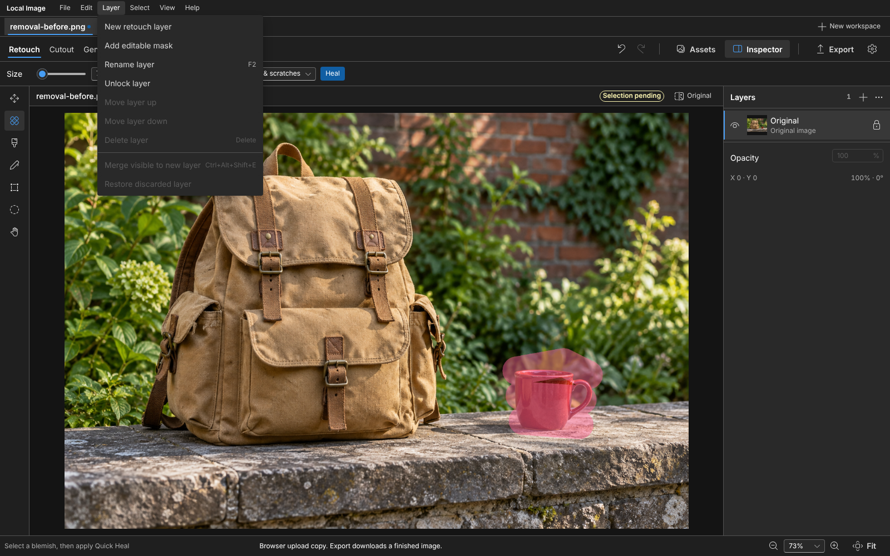
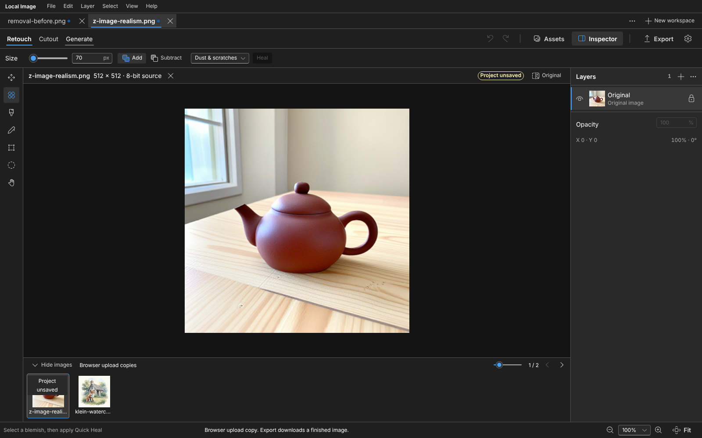
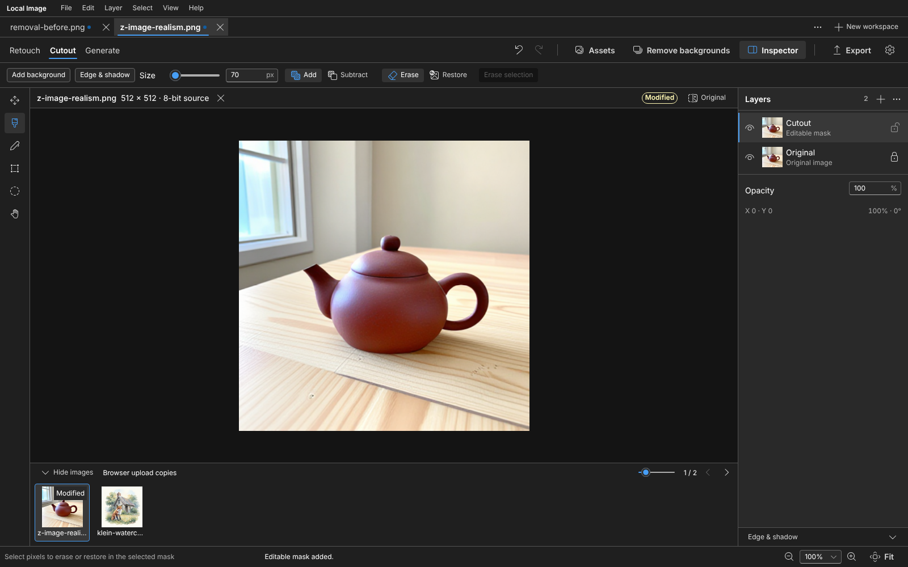
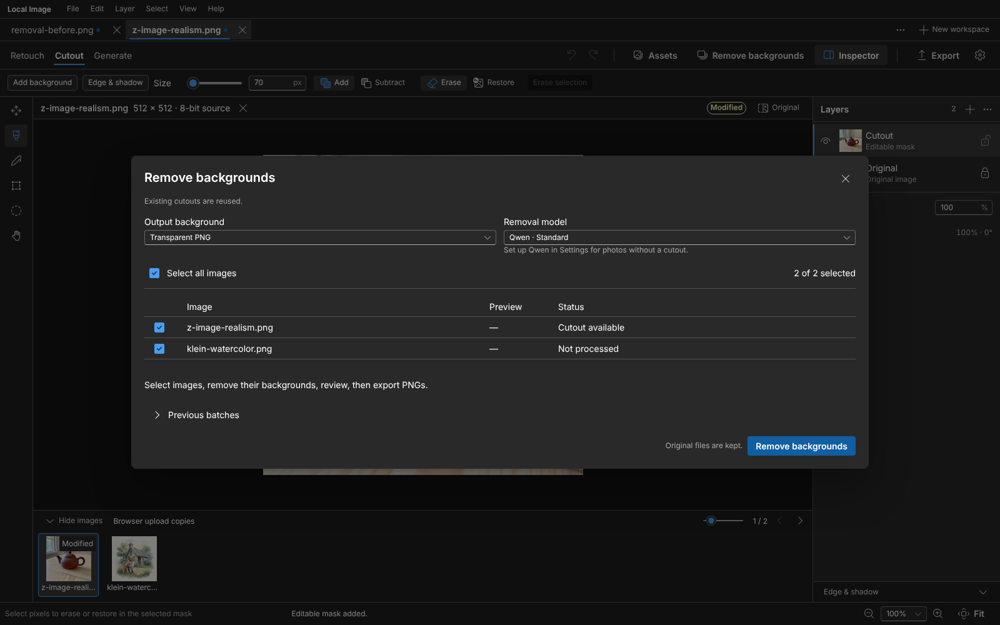
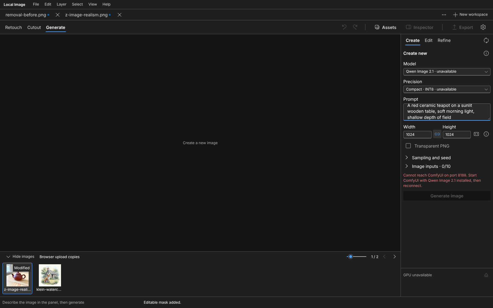
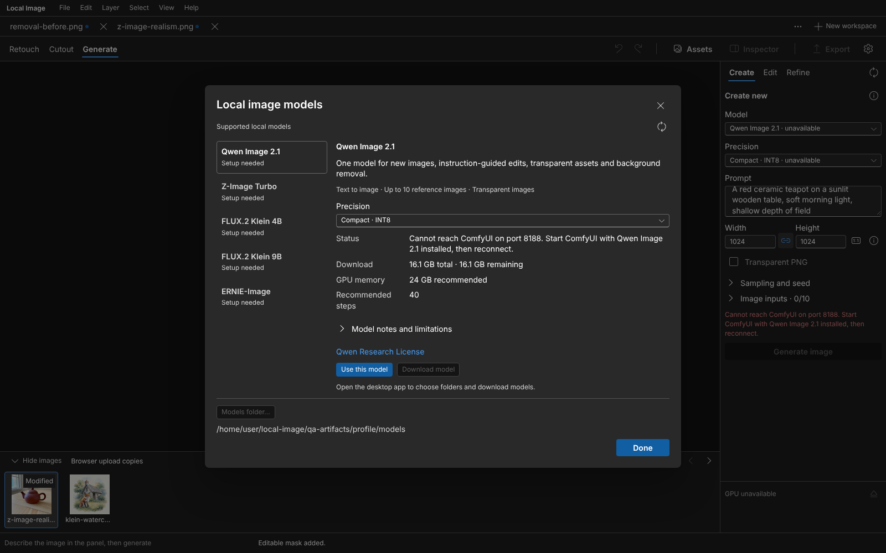

# Local Image

**Retouch, cut out, composite and generate images on your own PC.**

Local Image is a desktop image workspace for Linux and Windows. Editing runs on your CPU; the AI features run on your own GPU through [ComfyUI](https://github.com/comfyanonymous/ComfyUI). There is no cloud account, no upload and no per-image bill. The internet is used only when you ask for it: model downloads, stock-photo search and the live LoRA browser.

[**Download for Linux (0.7.3 preview)**](https://github.com/zdbosoxfan/local-image/releases/tag/v0.7.3-linux-preview) · [Download for Windows (0.7.0 preview)](https://github.com/zdbosoxfan/local-image/releases/tag/v0.7.0) · [Linux guide](docs/LINUX-INSTALLATION.md) · [Windows guide](docs/INSTALLATION.md) · [Model guide](docs/GEN-MODELS.md) · [Build from source](docs/DEVELOPMENT.md)

*The Retouch workspace. Click any screenshot to see it at full size.*

**A personal project.** Local Image is a vibe-coded personal project shared as-is. There is no guaranteed support and no guarantee of updates or improvements. [Open an issue](https://github.com/zdbosoxfan/local-image/issues) if something breaks; fixes are welcome but not promised.

**What you need for AI features.** A capable NVIDIA CUDA GPU with enough memory for the model you pick, roughly 16 to 32 GB depending on the preset (see [GPU and memory](#gpu-and-memory)). The project was tested on an RTX 5090 with 32 GB. Manual editing, Quick Heal, cutout mask editing and compositing work on any PC without a GPU.

## What it does

| Workspace | What you do there |
| --- | --- |
| **Retouch** | Paint, draw or select a blemish, then repair it with CPU **Quick Heal** or local **AI Remove** (FLUX.2 Klein). Every repair is its own layer above the protected original. |
| **Cutout** | Remove the background with Qwen, or start from an editable mask. Refine with Erase and Restore brushes, move, scale and rotate the subject, add an editable shadow, and put an imported, stock or generated image behind it. **Remove backgrounds** processes a whole set of images and exports transparent, white or custom-background PNGs. |
| **Generate** | Create images from a prompt, edit an open image with instructions, or run **Draft → Refine** to explore with a fast model and finish with a better one. Reference images, repeatable seeds, exact dimensions, transparent output and optional LoRA styles. Results land in a persistent library and can continue into Retouch or Cutout. |

Around the workspaces: image tabs with a filmstrip for folders, an **Assets** dock (Openverse stock search with credits, background folders, your generated library), editable `.lremove` projects that keep every layer and setting, lossless PNG, WebP and 16-bit TIFF export, and keyboard shortcuts for the common commands.

## The interface

The whole app is built on Microsoft's [Fluent design system](docs/DESIGN-SYSTEM.md): one set of components, icons, toolbars and dialogs, in a dark theme that stays out of the way of the image. Icon buttons carry tooltips, every picker is a real dropdown, and **Settings → Interface size → Large** scales the text to 200% while the command bar collapses to icons so the layout still fits an 800 × 560 window.

| Layers and menus | Several images at once |
| --- | --- |
|  |  |
| Conventional **File, Edit, Layer, Select, View** and **Help** menus with shortcuts. Repairs, masks and backgrounds stay visible in the Layers panel. | Each image is a tab. Open a folder and the filmstrip appears; unsaved tabs carry a dot. **New workspace** (Ctrl+N) starts another empty canvas without closing anything. |

### Retouch

Paint over the distraction, then choose **Heal** for the CPU repair or **AI Remove** for local FLUX.2 Klein inference. The brush overlay in the screenshot above is the app's real selection. The result of one actual local removal, exported from the app:

| Original | After AI Remove |
| --- | --- |
|  |  |

### Cutout and backgrounds

| Mask editing | Remove backgrounds in bulk |
| --- | --- |
|  |  |
| **Remove background** runs Qwen; **Layer → Add editable mask** starts a mask by hand. Erase and Restore brushes, pen and marquee selections, then **Add background** and **Edge & shadow**. | From the Cutout workspace, pick the images, choose transparent, white or an image background, review each result at full size and export PNGs or a ZIP. Previous batches stay available. |

### Generate

| The Generate panel | Model details |
| --- | --- |
|  |  |
| **Create**, **Edit** and **Refine** modes. The panel shows only the inputs the chosen model supports, with GPU usage and a **Stop** button while a job runs. (ComfyUI was not running when this was captured, so the model reads as unavailable.) | **Settings → Local AI → Model details…** compares each model's strengths, download size, GPU memory and licence, and downloads it with checksum verification. |

A few real outputs from the release test run, each linked to its original PNG; prompts, seeds and checksums are in the [example manifest](docs/images/examples/manifest.json):

| Transparent illustration | Photographic detail | Watercolor |
| --- | --- | --- |
|  |  |  |
| Qwen Image 2.1 · INT8, native RGBA | Z-Image Turbo, 8 steps | FLUX.2 Klein 4B |

| Clay miniature | Poster typography | Reference-guided character |
| --- | --- | --- |
|  |  |  |
| FLUX.2 Klein 4B | ERNIE-Image Base | Qwen Image 2.1 · INT8 |

More examples: [orange splatter illustration](docs/images/examples/klein-orange-illustration.png), [teal lighthouse](docs/images/examples/klein-teal-lighthouse.png), [blueprint espresso machine](docs/images/examples/klein-blueprint-espresso.png) and [children's-drawing submarine](docs/images/examples/z-image-playful-submarine.png). The 0.7 release run exercised 88 real cases and 440 exports; see the [validation report](docs/LOCAL-IMAGE-07-VALIDATION.md) for coverage and limits. Artistic quality varies with the prompt and style; exact identity, geometry and lettering are not guaranteed.

### Styles (LoRAs)

The LoRA library shows each style by its example images, with a details button for usage, trigger phrases, recommended settings and licence. Installed styles work offline; the live browser searches Hugging Face only when you ask, downloads only the selected Safetensors file and never installs code. An optional filter hides adult-rated results. Ten reviewed starting points are listed in the [LoRA guide](docs/LORA-LIBRARY.md).

## Models

| Model | Best suited to | Image inputs | Transparent output |
| --- | --- | --- | --- |
| Qwen Image 2.1 | Edits, background removal and transparent assets | Up to 10 semantic references | Yes, native RGBA |
| Z-Image Turbo | Fast generation | One starting image for variations | No |
| FLUX.2 Klein 4B | Fast reference editing and AI Remove | Up to 4 semantic references | No |
| FLUX.2 Klein 9B | Larger reference-editing model | Up to 4 semantic references | No |
| ERNIE-Image Base | Text-heavy posters and graphic layouts | Text only | No |
| SeedVR2 7B | Optional photo enhancement up to 4K | The image being enlarged | Keeps the source alpha |

Qwen comes in Compact INT8 and Full BF16 presets. Klein 4B uses BF16 and Klein 9B an FP8 preset; Klein 9B's publisher currently requires access approval, so it is listed but cannot be downloaded anonymously. Availability is checked against the running ComfyUI service, and the panel shows only the inputs a model supports. No model guarantees perfect text or layout. Details and caveats per model are in the [model guide](docs/GEN-MODELS.md), [ERNIE notes](docs/ERNIE-IMAGE.md) and [SeedVR2 notes](docs/SEEDVR2.md).

### GPU and memory

| AI workload | Planning recommendation |
| --- | --- |
| Z-Image Turbo, FLUX.2 Klein 4B and Klein AI Remove | 16 GB VRAM |
| Qwen Compact INT8, Klein 9B and ERNIE-Image | 24 GB VRAM |
| Qwen Full BF16 and SeedVR2 4K enhancement | 32 GB VRAM |

Actual use depends on image size, reference count and ComfyUI offloading; offloading to system RAM works but is much slower. Model files also take tens of gigabytes of disk. **Help → Hardware guide** shows the detected GPU memory and this table inside the app.

## Install

### Linux x86-64

Download from the [0.7.3 Linux preview](https://github.com/zdbosoxfan/local-image/releases/tag/v0.7.3-linux-preview):

- **Ubuntu 24.04 or newer:** open the `.deb` with your package installer, or run `sudo apt install ./Local-Image-0.7.3-linux-preview-linux-x86_64.deb`.
- **Fedora 44 or another compatible desktop:** extract the `.tar.gz` and run `./install.sh` from its folder as your normal user.

Both add **Local Image** to the application menu and include Python, Qt and the editor; nothing else needs installing. The preview needs glibc 2.39 or newer, a graphical desktop and working graphics drivers, and does not support ARM or 32-bit systems. `SHA256SUMS` verifies the downloads. Full requirements, storage locations and troubleshooting are in the [Linux guide](docs/LINUX-INSTALLATION.md).

### Windows x64

[Download the 0.7.0 installer](https://github.com/zdbosoxfan/local-image/releases/download/v0.7.0/Local-Image-Setup-0.7.0.exe) (checksum on the [release page](https://github.com/zdbosoxfan/local-image/releases/tag/v0.7.0)). Install for all users in Program Files or for yourself in AppData. The installer is not code-signed yet, so Windows shows its SmartScreen warning. Windows can also set up a dedicated portable ComfyUI runtime from inside the app.

The Windows installer predates the current interface: it still has the previous 0.7 layout. The code on `main` builds and runs on Windows with the new interface ([build instructions](docs/DEVELOPMENT.md)); a new Windows installer will appear on the releases page when one is built.

### After installing

1. Open **Settings → Local AI**. Detect or choose an existing ComfyUI installation (Windows can also install a portable one), pick a model folder and download the models you want. Downloads check publisher revisions, sizes and SHA-256 checksums.
2. Open an image, or drop a folder of images, and start in Retouch, Cutout or Generate. The first launch offers **Repair a photo**, **Remove a background**, **Create an image** and **Set up AI**.
3. **Settings → General → Updates** checks GitHub for a newer release for your platform, downloads and verifies it, then closes the app and starts the installer (Windows) or opens the package in your system installer (Linux). A quiet daily check marks the Settings button when something newer exists; nothing downloads on its own.

Settings, projects, recovery data, the generated library and model folders live in your user profile (`%LOCALAPPDATA%\Local Image` on Windows, `~/.local/share/local-image` on Linux) and survive updates and uninstalls. Everything runs on `http://127.0.0.1:51247` on your own machine. No administrator rights are needed for normal editing.

## Guides

- [Linux installation, updates and optional AI](docs/LINUX-INSTALLATION.md)
- [Windows installation, AI setup and storage](docs/INSTALLATION.md)
- [Cutout editing and compositing](docs/CUTOUT-WORKSPACE.md)
- [Background removal in bulk](docs/BATCH-WORKSPACE.md)
- [Image generation: references, Draft & Refine, upscaling](docs/IMAGE-GENERATION.md)
- [Generation models and their inputs](docs/GEN-MODELS.md)
- [Generated-image library](docs/GENERATION-LIBRARY.md)
- [LoRA styles and the live browser](docs/LORA-LIBRARY.md)
- [SeedVR2 upscaling and its measured limits](docs/SEEDVR2.md)
- [ERNIE poster preset and exact-text evaluation](docs/ERNIE-IMAGE.md)
- [Stock image search, import and attribution](docs/STOCK-LIBRARY.md)
- [Design system and interface rules](docs/DESIGN-SYSTEM.md)
- [Build, test and release from source](docs/DEVELOPMENT.md)
- Validation reports: [0.7.0 usability and gallery](docs/LOCAL-IMAGE-07-VALIDATION.md), [0.6.0 installation](docs/INSTALLATION-VALIDATION.md), [0.5.0 model quality](docs/LOCAL-IMAGE-VALIDATION.md), [0.4.0 cutout](docs/QWEN-VALIDATION.md)

The screenshots above are real captures of the current interface from the source build; nothing is mocked or edited. Captures of the earlier 0.7 interface, including real AI results inside the app and a live stock search with its [image credits](docs/images/ui/0.7/STOCK-CREDITS.md), are kept in [docs/images/ui/0.7](docs/images/ui/0.7).

## Licences

Local Image's own code is under the licence in [backend/LICENSE](backend/LICENSE); bundled components are listed in [THIRD_PARTY_NOTICES](backend/THIRD_PARTY_NOTICES.md). Models are separate downloads with their own terms: Qwen Image 2.1 uses the [Qwen Research License](https://github.com/QwenLM/Qwen-Image-2.1/blob/main/LICENSE), FLUX.2 Klein 9B a [non-commercial licence](https://huggingface.co/black-forest-labs/FLUX.2-klein-9B/blob/main/LICENSE.md), and Z-Image Turbo, FLUX.2 Klein 4B, ERNIE-Image and SeedVR2 Apache 2.0. LoRAs and stock images carry their own licences, which the app shows and keeps with imported credits. The installers bundle no model weights and grant no model rights.
