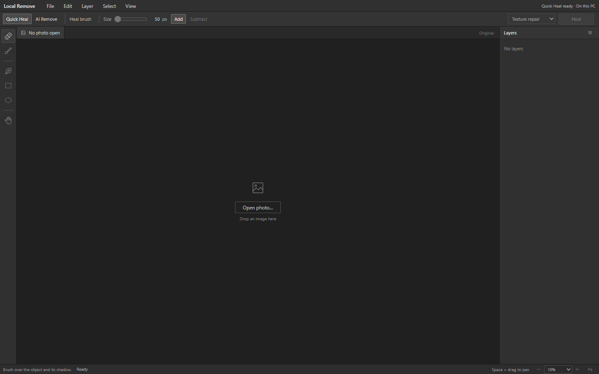

# Local Remove

**A Windows photo editor for local object removal, quick healing, and editable layers.**

Local Remove helps you remove unwanted objects and repair small distractions in photos. Quick Heal runs on your PC's CPU. AI Remove uses FLUX Klein through a local ComfyUI backend. Settings can find an existing installation, install a separate copy, download the FLUX files, start the backend, and release its GPU memory.

The Windows installer includes the application, Python runtime, and healing tools. You do not need ChatGPT, Codex, a source checkout, or a separate Python installation to use it.

## Interface preview

Version 0.3.0 includes the refreshed photo workspace and integrated AI setup.
This development branch builds the 0.3.0 Windows installer; older published releases may have the previous interface.

The editor groups repair controls beside the photo, starts with local Quick Heal,
and keeps image copies separate from editable projects. See the
[design review](docs/UI-DESIGN.md) and [validation notes](docs/UI-VALIDATION.md).

## Install

1. Run **Local-Remove-Setup-0.3.0.exe** from the Windows build output. See [build instructions](docs/DEVELOPMENT.md); published installers are listed under [Releases](https://github.com/zdbosoxfan/local-remove/releases).
2. Run the installer for your Windows account. It creates Start menu shortcuts and an optional desktop shortcut.
3. Open **Local Remove** from the Start menu.

**Requirements:** Windows 10 or 11, 64-bit. Setup installs Microsoft's WebView2 Runtime if it is missing; that prerequisite download requires an internet connection. The current preview installer is not code-signed.

Quick Heal is included and works without ComfyUI or model downloads. To enable AI Remove, follow the connection steps below.

## Edit a photo

1. Use **File → Open** or **Open Folder**, or drop images from File Explorer into the desktop window.
2. Select the object with the brush, pen, rectangle, or ellipse tool. Include the object's shadow when needed.
3. Choose **Quick Heal** for small distractions or **AI Remove** for larger objects and scene reconstruction.
4. Apply the removal, review the result, and use **Original** to compare it with the starting image.
5. Save your work using the appropriate option:

| Save option | What it keeps |
| --- | --- |
| **Save Project** | The original and applied layers in an editable `.lremove` file. |
| **Save a copy** | A separate flattened image beside the source file. |
| **Overwrite original** | A flattened result that replaces the source image. |
| **Export** | A flattened image saved through a save dialog. |

Layers can be hidden, discarded, or merged into a new layer. Save an editable project to continue retouching later. Unapplied brush selections and unfinished pen paths are not included in projects.

Supported formats are **JPEG, PNG, TIFF, and WebP**. For camera RAW files, send a rendered image from your RAW editor.

### Choose a healing method

- **Texture repair** copies nearby texture to repair small objects and blemishes.
- **Dust & scratches** fills narrow defects using nearby colors.
- **AI Remove** uses FLUX Klein for larger objects and scene reconstruction.

### Set up AI removal

Open **Settings** in the editor. The desktop app provides these controls:

1. **Find existing** finds existing ComfyUI source, portable, and supported Desktop layouts. Choose the one to use, or browse to it. **Install ComfyUI** downloads the official NVIDIA portable runtime into a separate `LocalRemove-ComfyUI` subfolder of the folder you choose.
2. **Choose model folder** selects where to keep the FLUX files. Select an existing model folder to reuse your downloads. **Download FLUX models** fetches missing files and verifies all four files against pinned publisher checksums. The complete set is about 15.1 GiB; ComfyUI needs additional disk space.
3. **Start backend** starts the selected local runtime. FLUX loads into GPU memory when you apply the first AI removal.
4. **Eject model** asks an idle ComfyUI backend to unload its models and release GPU memory. It leaves ComfyUI running. Active or queued work prevents unloading.

Use **Advanced connection** for a different local port. Quick Heal is always independent of ComfyUI. Folder picking, downloads, installation, and backend controls require the Windows desktop app; a browser preview can inspect setup status.

| FLUX component | File beneath the model folder |
| --- | --- |
| Base model | `diffusion_models/flux-2-klein-base-4b.safetensors` |
| Text encoder | `text_encoders/qwen_3_4b.safetensors` |
| Image decoder | `vae/flux2-vae.safetensors` |
| Removal adapter | `loras/flux-2-klein-object-remove.safetensors` |

The Qwen3-named text encoder is required by FLUX. The separate Qwen image-edit removal model is no longer offered. Earlier projects keep their existing rendered layers.

Downloads use pinned official release/model URLs with byte-count and SHA-256 validation. Existing files with unknown checksums are preserved, and interrupted downloads never appear as completed models. See [the artifact catalog](backend/ai_download_catalog.py). FLUX uses built-in ComfyUI nodes from [specialized_removal.py](backend/specialized_removal.py).

### Use with Capture One

Choose **Edit With** in Capture One and select the installed `Local Remove.exe`. Send a rendered TIFF or JPEG. After editing, use **Overwrite original** to update that rendered file. Also use **Save Project** if you want to retain the editable Local Remove layers.

The default executable location is `%LOCALAPPDATA%\Programs\Local Remove\Local Remove.exe`.

## Where your files are stored

Local Remove follows a per-user Windows installation layout. Updates replace application files without replacing your settings or recoverable edits.

| Files | Default location |
| --- | --- |
| Application and bundled runtime | `%LOCALAPPDATA%\Programs\Local Remove` |
| AI connection settings | `%LOCALAPPDATA%\Local Remove\config.json` |
| Editor settings and recoverable sessions | `%LOCALAPPDATA%\Local Remove\state` |
| Disposable image cache and thumbnails | `%LOCALAPPDATA%\Local Remove\cache` |
| Diagnostic logs | `%LOCALAPPDATA%\Local Remove\logs` |
| Embedded browser profile | `%LOCALAPPDATA%\Local Remove\WebView2` |
| Saved photos and `.lremove` projects | The location you choose in the app. |

`%LOCALAPPDATA%` is your Windows account's local AppData folder. Paste a path from the table into File Explorer's address bar to open it.

Logs rotate automatically. Thumbnail cleanup removes old or excess thumbnails when the app starts. Recoverable edits are kept separately and are never removed by disposable-cache cleanup. The background service shuts down after the last desktop window has been closed and it has been idle for about 75 seconds.

## Update or uninstall

Save your edits, close Local Remove, and run a newer installer to update it. Setup stops the idle background service before replacing program files.

To uninstall, use **Windows Settings → Apps → Installed apps → Local Remove → Uninstall**. Uninstalling removes the app and shortcuts while retaining settings, recoverable sessions, and your saved photos/projects.

If you used the earlier Documents-based version, save its unfinished work as `.lremove` projects and open those projects in the installed version. The installer leaves the earlier installation and its local data untouched.

## Troubleshooting

| Problem | Check |
| --- | --- |
| AI Remove is unavailable | Open **Settings**, check the four FLUX files, and use **Start backend**. Confirm the port in **Advanced connection**. Quick Heal remains available. |
| Texture repair is unavailable | Re-run the installer to restore the bundled helper and dependencies. |
| The editor window cannot load | Re-run setup and confirm Microsoft WebView2 installed successfully. Details are saved in the app's `logs` folder. |
| Save a copy or Overwrite original is unavailable | Open the image through the desktop app's native file/folder picker or Explorer drag-and-drop. |
| An exported image has no editable layers | Open the `.lremove` project. JPEG, PNG, TIFF, and WebP exports are flattened. |

## Development and backup

- [Build and test instructions](docs/DEVELOPMENT.md)
- [Desktop host details](desktop/NativeHost-README.md)
- [Original backup provenance](docs/BACKUP.md)

`backend/` contains the runnable editor and server, `desktop/` contains the Windows host source, `packaging/` builds the installer, and `tests/` contains the regression tests. Generated files, credentials, caches, and personal photo projects are excluded from Git.

## Credits and licenses

Local Remove uses the RapidRAW AI Connector, Microsoft WebView2, Embark Studios texture-synthesis, OpenCV, py7zr, and PyYAML. Existing component licenses are retained:

- [Backend license](backend/LICENSE)
- [Third-party notices](backend/THIRD_PARTY_NOTICES.md)
- [Microsoft WebView2 license](desktop/licenses/Microsoft-WebView2-LICENSE.txt) and [notices](desktop/licenses/Microsoft-WebView2-NOTICE.txt)

No new project-wide license has been selected.
