<p align="center">
  <a href="https://getartcraft.com/">
    <picture>
      <source media="(prefers-color-scheme: dark)" srcset="docs/brand/artcraft-logo-white.svg">
      
    </picture>
  </a>
</p>


<h1 align="center">LightCraft</h1>

<h3 align="center">Your photos. Your pixels. Your machine.</h3>

<p align="center">
  <b>Photo library and raw development; an open-source, clean-room reimplementation of Adobe Lightroom, rebuilt in pure Rust.</b><br>
  Native on macOS, Windows and Linux. In the browser via WebAssembly. Drivable end to end by AI agents over MCP.
</p>

<p align="center">
  
  
  
  
  <a href="ROADMAP.md"></a>
</p>

<p align="center">
  <a href="https://discord.gg/artcraft"></a>
</p>

<p align="center">
  <a href="https://getartcraft.com/apps/lightcraft"><b>LightCraft on getartcraft.com</b></a> ·
  <a href="https://getartcraft.com/">ArtCraft</a> ·
  <a href="https://getartcraft.com/apps">All Crafting Apps</a>
</p>

<br>

<p align="center">
  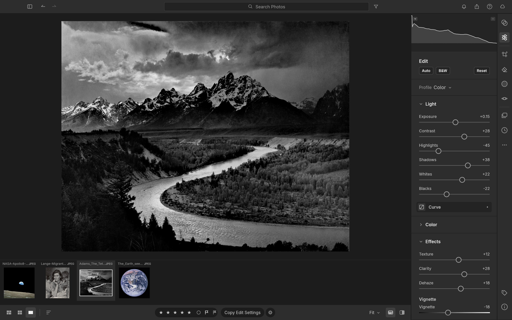
  <br>
  <sub><i>Ansel Adams, "The Tetons and the Snake River" (1942). Public domain, U.S. National Archives. Developed in LightCraft.</i></sub>
</p>

> [!NOTE]
> **ArtCraft is a community of artists from all walks of life.** Digital, generative, music,
> games &mdash; if you make things, you're one of us. **[Come say hi on Discord](https://discord.gg/artcraft).**

<p align="center">
  <a href="#edit-like-you-mean-it">Editing</a> ·
  <a href="#color-grading-the-cinematic-way">Color grading</a> ·
  <a href="#before--after">Before &amp; after</a> ·
  <a href="#masking-that-goes-where-you-point">Masking</a> ·
  <a href="#presets-profiles--the-color-mixer">Presets</a> ·
  <a href="#organize-everything">Library</a> ·
  <a href="#built-for-agents">Agents &amp; MCP</a> ·
  <a href="#fast-native-private">Performance</a> ·
  <a href="#feature-status">Status</a> ·
  <a href="#quick-start">Quick start</a> ·
  <a href="ROADMAP.md">Roadmap</a> ·
  <a href="#the-crafting-apps">Crafting Apps</a>
</p>

<br>

## Edit like you mean it

LightCraft is a complete darkroom in a single native app. Every adjustment is **non-destructive**, so your originals
are never touched. Every slider renders through a **scene-referred, wide-gamut, 32-bit float pipeline**: highlights
roll off like film, shadows open up without halos, and colour stays clean from capture to export.

<table>
<tr>
<td width="50%" valign="top">

### ☀️ Light
**Exposure, Contrast, Highlights, Shadows, Whites, Blacks**, with edge-aware local tone mapping (a guided filter on
log-luminance). Pulling −100 Highlights recovers a blown sky without the grey halos you'd get from a naive curve.

### 🎨 Color
**White balance** by temperature and tint (Kelvin for raw, relative for JPEG) with presets, Auto and a
click-to-neutralise **eyedropper**. **Vibrance** that protects skin tones, **Saturation**, an 8-band **Color Mixer**
(hue / saturation / luminance) and 3-way **Color Grading** wheels with blending and balance. All of it is computed in
OkLCh, a modern perceptual colour space.

</td>
<td width="50%" valign="top">

### ✨ Effects
**Texture** for fine detail, **Clarity** for mid-tone punch, **Dehaze** (dark-channel prior with guided refinement;
push it negative to add atmosphere), post-crop **Vignette** with highlight priority, roundness and feather, and
resolution-independent film **Grain** with size and roughness.

### 📈 Tone Curve
Parametric region curve with movable splits **plus** point curves for RGB, Red, Green and Blue. Curves are monotone by
construction, so you never get an accidental tone inversion.

</td>
</tr>
</table>

<p align="center">
  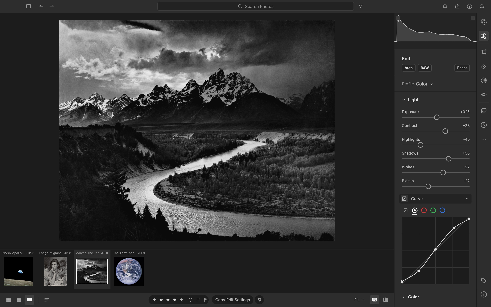
  <br>
  <sub>A gentle S on the RGB point curve, right under the Light sliders. <i>Ansel Adams, 1942 (public domain).</i></sub>
</p>

<br>

## Color grading, the cinematic way

Split-tone shadows, midtones and highlights independently with drag-anywhere colour wheels. Below, Dorothea Lange's
*Migrant Mother* gets a warm, print-like tone (highlights at 42°, shadows at 28°) in two drags.

<p align="center">
  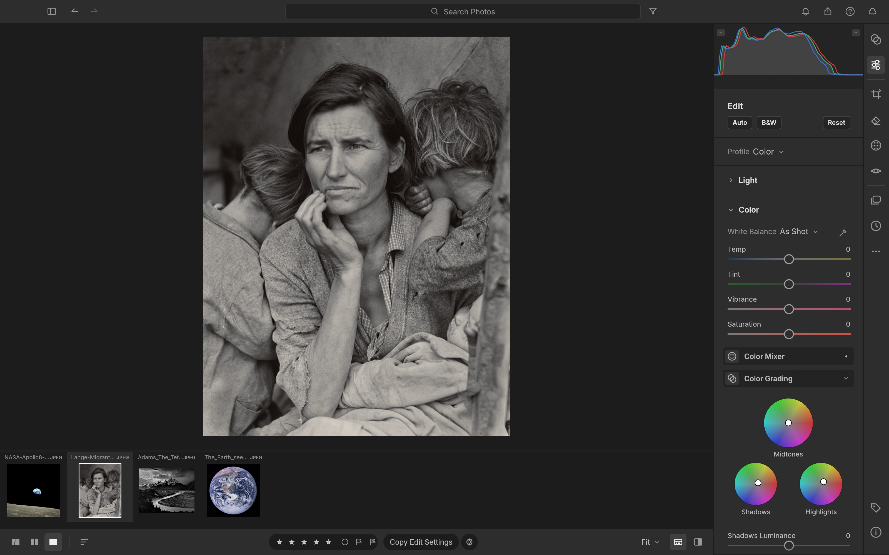
  <br>
  <sub>Shadows, midtones and highlights wheels in the Color panel. <i>Dorothea Lange, "Migrant Mother" (1936). Public domain, Library of Congress.</i></sub>
</p>

<br>

## Before & after

Hold <kbd>\\</kbd> to peek at the original, press <kbd>Y</kbd> for side by side, or <kbd>Shift</kbd>+<kbd>Y</kbd> for a
split view. Every image below is a real screenshot of LightCraft, captured automatically by an agent through the
[control channel](#built-for-agents).

<table>
<tr>
<td width="50%">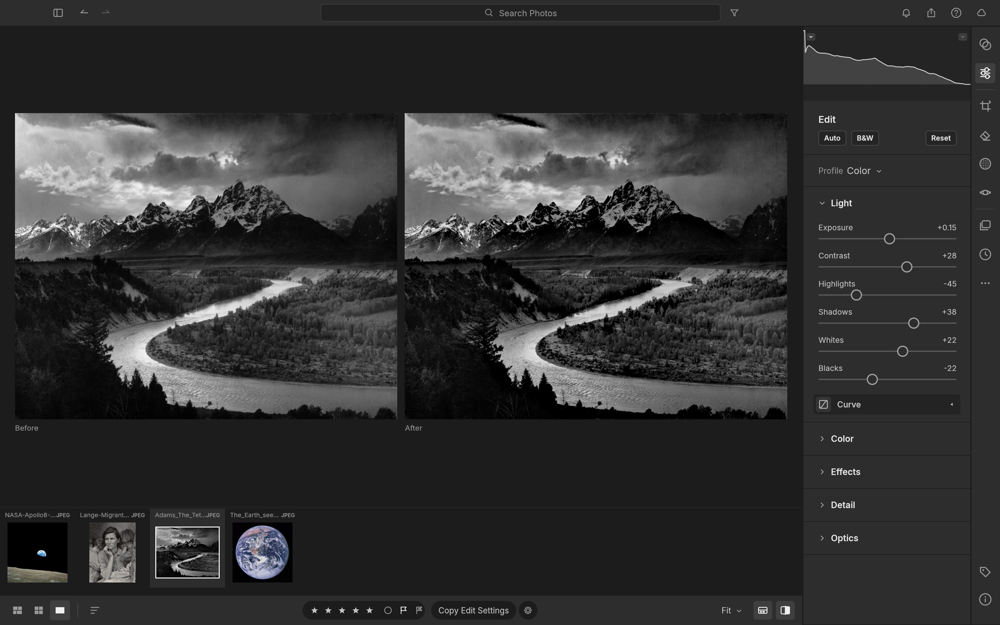<br><sub><b>The Tetons and the Snake River.</b> Highlights −45, Shadows +38, Clarity +28, Dehaze +18. <i>Ansel Adams, 1942 (public domain).</i></sub></td>
<td width="50%">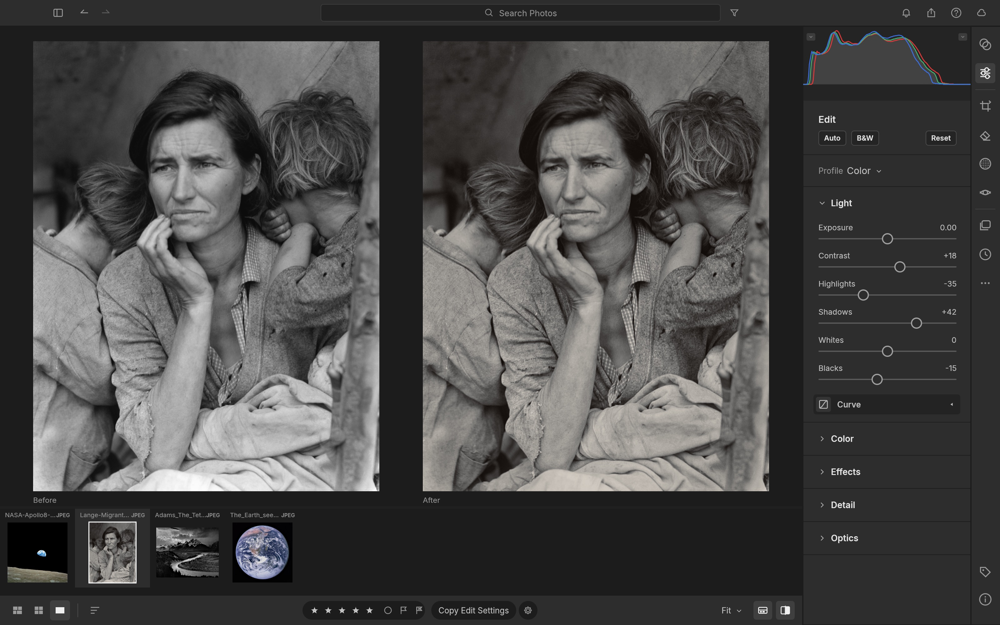<br><sub><b>Migrant Mother.</b> Shadows +42, Texture +18, split-toned grade, vignette. <i>Dorothea Lange, 1936 (public domain).</i></sub></td>
</tr>
<tr>
<td width="50%">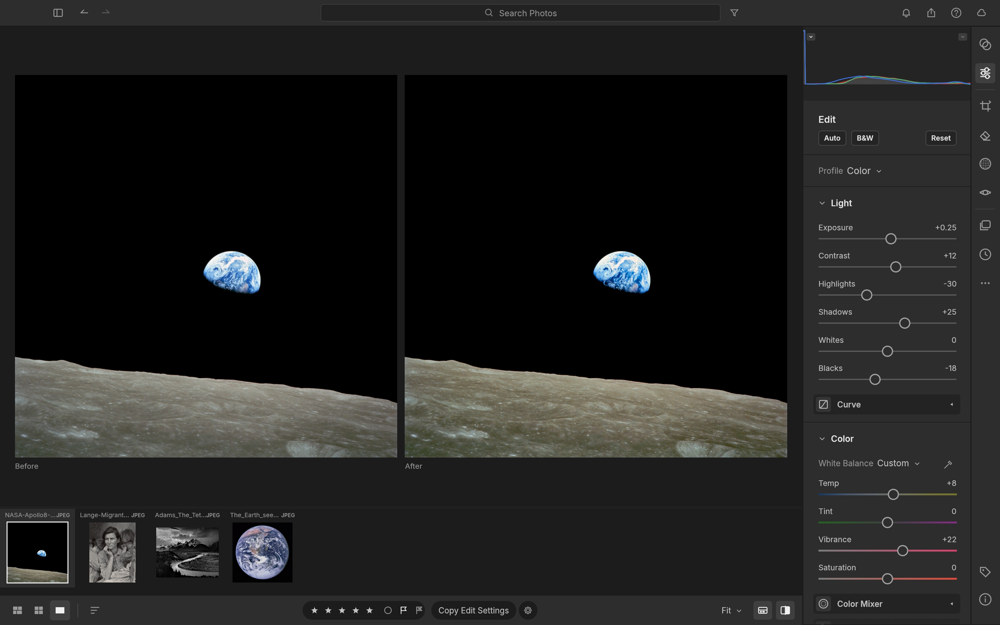<br><sub><b>Earthrise.</b> Dehaze +22, Highlights −30, warmer white balance, Vibrance +22. <i>NASA / Bill Anders, Apollo 8, 1968 (public domain).</i></sub></td>
<td width="50%"><br><sub><b>The Blue Marble.</b> Highlights −38, Blacks −20, Dehaze +15, Vibrance +30. <i>NASA, Apollo 17, 1972 (public domain).</i></sub></td>
</tr>
</table>

<br>

## Masking that goes where you point

Paint with a **Brush** (size, feather, flow, density, erase), drop **Linear** and **Radial Gradients** with draggable
pins, or select by **Luminance Range**, **Color Range**, **Sky**, **Subject** and **Background**. Combine components
with **Add / Subtract / Intersect**, invert any of them, and dial in 15 local adjustments per mask (Temp, Tint,
Exposure, Contrast, Highlights, Shadows, Whites, Blacks, Texture, Clarity, Dehaze, Hue, Saturation, Sharpness, Noise)
plus an overall Amount.

<p align="center">
  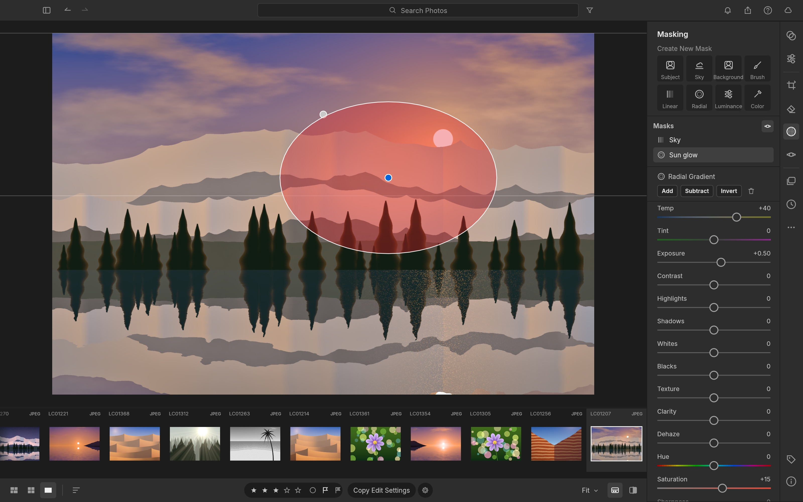
  <br>
  <sub>A radial "Sun glow" mask (Temp +40, Exposure +0.50) layered over a linear "Sky" mask. <i>Photo from LightCraft's procedurally generated demo library.</i></sub>
</p>

<br>

## Presets, profiles & the Color Mixer

Eighteen hand-built presets ship in the box (*Golden Hour, Teal & Orange, Faded Matte, Selenium Tone, Crisp
Landscape* and more), each with an **Amount** slider from 0 to 200 %. Save your own from any group of settings, mark
favourites, and copy, paste or sync edits across a whole selection with exactly the groups you choose.

<p align="center">
  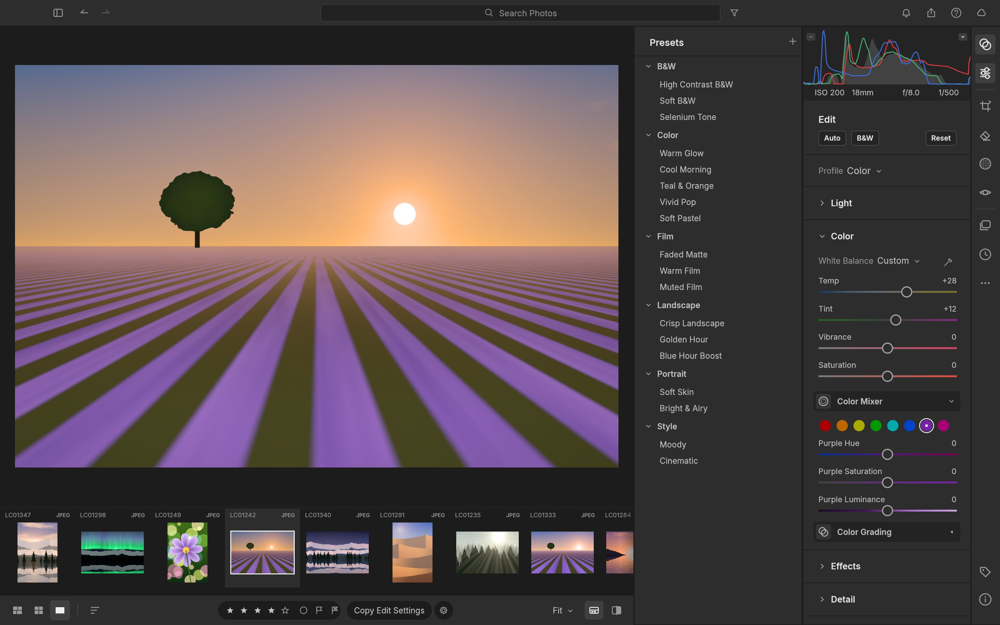
  <br>
  <sub>The Presets column next to the 8-band Color Mixer. <i>Photo from the demo library.</i></sub>
</p>

<table>
<tr>
<td width="50%" valign="top">

### ✂️ Crop, straighten & geometry
Free or locked aspect ratios (1:1, 4:5, 5:7, 2:3, 4:3, 16:9, 16:10, original), drag-to-rotate straightening that always
keeps the largest crop inside the image, thirds / grid / golden-ratio overlays, flips and 90° rotations, plus
manual Vertical, Horizontal, Rotate, Aspect, Scale and Offset transforms.

</td>
<td width="50%" valign="top">

### ⚫️ Black & White
One click (<kbd>V</kbd>) to monochrome, with an 8-band **B&W Mix** that lets you darken skies or make foliage glow.
Then tone it with Color Grading for selenium, sepia or split-tone prints.

</td>
</tr>
<tr>
<td width="50%">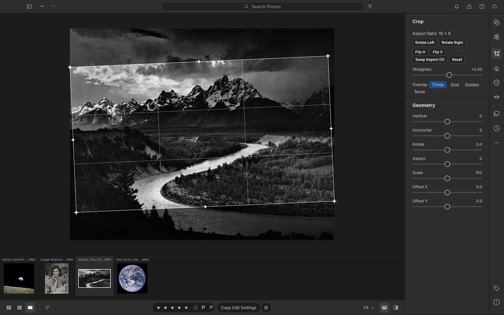<br><sub>A 16:9 crop straightened +2.5° with the thirds overlay. <i>Ansel Adams, 1942 (public domain).</i></sub></td>
<td width="50%"><br><sub>Split view: colour original on the left, B&W with Clarity, Vignette and Grain on the right. <i>Demo library.</i></sub></td>
</tr>
</table>

<br>

## Organize everything

A library that stays out of your way: **All Photos**, **Recently Added**, **Picks**, **By Date**, **Albums** nested in
**Folders**, and **Recently Deleted**. Rate with <kbd>0</kbd>–<kbd>5</kbd>, flag with <kbd>P</kbd> / <kbd>X</kbd> /
<kbd>U</kbd>, colour-label with <kbd>6</kbd>–<kbd>9</kbd>. Search understands fields:
`rating:>3 flag:pick iso:>800 camera:x2 date:2026-04 keyword:mountains`. Every view sorts by capture date,
import date, edit date, name, rating, size or at random (a stable shuffle; View → Sort → Reshuffle for a new one). The justified **Photo Grid** and **Square Grid** views are virtualized,
so they stay smooth whether you have forty photos or forty thousand.

<table>
<tr>
<td width="50%">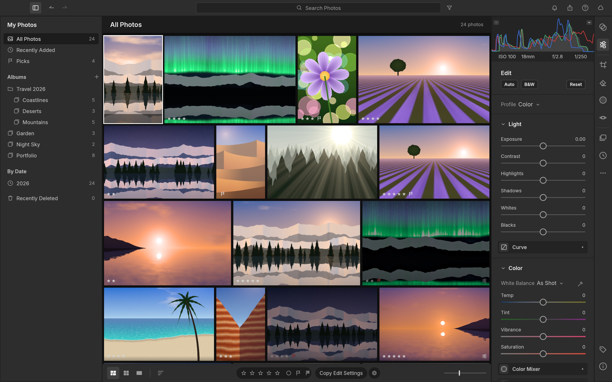<br><sub>Photo Grid with albums nested in a folder, ratings and flags. <i>Demo library.</i></sub></td>
<td width="50%">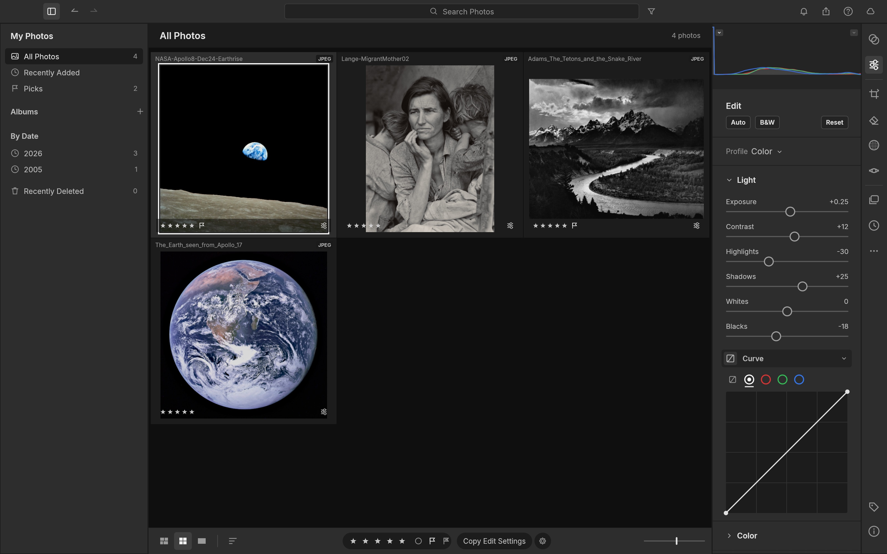<br><sub>Square Grid of the four public-domain showcase photos.</sub></td>
</tr>
<tr>
<td colspan="2"><br><sub>The Info panel: file, dimensions, rating, title, caption, copyright and camera metadata. <i>NASA / Bill Anders, "Earthrise", Apollo 8, 1968 (public domain).</i></sub></td>
</tr>
</table>

<br>

## Built for agents

Every menu item, slider, brush stroke, crop handle and keystroke in LightCraft is a **command** with a stable id and
JSON parameters. The UI, the keyboard, the CLI, a JSON-lines control channel and an **MCP server** all dispatch
through the same entry point. An agent can cull a shoot, develop it, mask a sky and export it, and *see* the result.

```sh
lightcraft --control 7980 ~/Pictures/trip
```
```jsonc
{"method": "engine.execute", "params": {"command": "photo.flag",  "params": {"flag": "pick"}}}
{"method": "engine.execute", "params": {"command": "develop.set", "params": {"values": {"light.highlights": -45, "light.shadows": 38}}}}
{"method": "engine.execute", "params": {"command": "mask.add",    "params": {"kind": "radial", "center": [0.62, 0.4], "rx": 0.2, "ry": 0.14}}}
{"method": "ui.clickWidget",   "params": {"id": "slider:effects.clarity"}}       // drive any widget by name
{"method": "ui.pointer",       "params": {"events": [{"kind":"down","x":0.2,"y":0.3}, {"kind":"up","x":0.4,"y":0.3}]}}
{"method": "ui.screenshot",    "params": {"path": "after.png"}}
```

- **Command registry.** `engine.commands` lists the available commands; `develop.controls` lists every slider's
  range, default and current value.
- **MCP server.** `lightcraft-cli mcp` exposes the command registry to Claude (or any MCP client), alongside
  helpers for import, query, develop, mask, render (returned as an image) and export. It runs headless, or attached
  to the running app with screenshots, clicks and gestures. See [docs/mcp.md](docs/mcp.md).

  ```sh
  cargo build --release -p lightcraft-cli
  claude mcp add lightcraft -- "$PWD/target/release/lightcraft-cli" mcp ~/Pictures/shoot          # headless
  claude mcp add lightcraft-app -- "$PWD/target/release/lightcraft-cli" mcp --connect 127.0.0.1:7980  # live app
  ```
- **Scriptable CLI:** `lightcraft-cli run --import in.dng develop.set control=light.exposure value=0.7 app.export
  path=out.jpg longEdge=2048` runs any chain of commands (headless, on a saved library, or against the running app)
  and prints one JSON result per command; `lightcraft-cli render in.dng -o out.jpg --set light.exposure=0.7 --preset …`.
- **Undo for everything**, including agent actions: a slider drag (or a scripted burst of updates) is one undo step.
- **Every widget is addressable** (`ui.widgets`) and clickable by name, so agents operate the real UI, not a
  side door.
- The screenshots in this README were produced end to end by the [`docs/showcase/`](docs/showcase/) scripts.
  Protocol reference: [docs/control-protocol.md](docs/control-protocol.md).

<br>

## Fast, native, private

- **Pure Rust, no C.** Our own RAW decoders (DNG, Canon CR2, Sony ARW, Nikon NEF, Fujifilm RAF incl. X-Trans,
  Panasonic RW2 / Leica RWL, Pentax PEF, Olympus ORF), our own colour science, our own pipeline. JPEG, PNG, TIFF, WebP,
  PSD composites and JPEG XL open today.
- **Scene-referred & wide-gamut.** Linear Rec.2020 float internally, Bradford-adapted white balance, gamut mapping
  instead of clipping, a filmic shoulder for raw and pixel-exact pass-through for JPEGs you haven't touched.
- **Resolution-independent edits.** Radii and brush sizes are relative to the image, so a 400 px preview, your
  5K display and a 60 MP export look the same.
- **GPU-accelerated, CPU-exact.** The whole develop pipeline runs as wgpu compute kernels (Metal / Vulkan / DX12),
  checked against the CPU pipeline to within 1/255. On a 24 MP raw (Apple M4 Pro): a slider update re-renders in
  ~4 ms, a cold 2.5 MP loupe in ~30 ms, and a full-size export in ~0.3 s including a parallel JPEG encode.
  Without a GPU the same pipeline runs on all CPU cores, redoing only the stages a slider affects.
- **Instant culling.** Opening a raw shows its embedded camera preview or cached render within ~0.1 s while the
  full render follows (~0.2–0.5 s for 24 MP). The next and previous photos are prepared in the background, so stepping
  through a shoot takes ~50 ms per photo.
- **Background rendering.** A worker pool renders the loupe, before/after and every visible thumbnail off the UI
  thread: drafts during drags, full quality on release.
- **Local-first.** No account, no cloud, no telemetry, no subscription. Your catalog is an append-only log of
  human-readable operations you can diff, back up or replay.

<br>

## Feature status

LightCraft is young and moving fast. **Where we honestly stand** (details in the [roadmap](ROADMAP.md#where-we-stand)):

- **By feature count we're at ~79%** of Lightroom (core features 98%), tracked row by row in
  [docs/parity.md](docs/parity.md).
- **As a day-to-day Lightroom replacement we're nearer 60–70%.** It's great for JPEG/DNG and most Nikon / Sony /
  older-Canon raws on one machine.
- **The biggest gaps:**
  - **camera colour calibration:** raws other than DNG develop with a neutral colour matrix today, so colour is muted;
  - **CR3 and compressed Fujifilm / Olympus raws:** these open as embedded previews only;
  - **AI masks and denoise:** subject and sky selection are classical heuristics;
  - **HDR, video and the Classic Print / Book / Map modules.**
- **What's next:** see [where we're going](ROADMAP.md#where-were-going).

| Area | Status |
|---|---|
| Library: albums, folders, smart albums, stacks (incl. auto-stack), virtual copies, ratings, flags, labels, filter bar, search, sort, grids, filmstrip | ✅ |
| Culling: Compare (synced zoom) and Survey views, auto-advance, instant previews | ✅ |
| Light, Color, Effects (vignette styles), Tone Curve (+ refine saturation, targeted adjustment), Color Mixer (+ targeted), Point Color, Color Grading, Calibration, B&W | ✅ |
| Masking: brush, linear, radial, luminance/colour range, add/subtract/intersect | ✅ (AI subject/sky use classical heuristics for now) |
| Crop, straighten tool + auto straighten, flip, rotate, aspect ratios, overlays | ✅ |
| Profiles (Color, Neutral, Vivid, Landscape, Portrait, Monochrome: our own looks), presets, versions, history, copy/paste/sync settings | ✅ |
| Camera colour: DNG files use their own matrices | ✅ · our own calibration for other raws ⬜ (top priority; ARW, NEF and RW2 start from a look fitted to their own JPEG, other raws from a neutral fallback) |
| Native macOS menu bar (generated from the command registry), control channel + every widget addressable, headless UI snapshots | ✅ |
| RAW: DNG, CR2, ARW, NEF (uncompressed + lossless/lossy compressed), Fujifilm RAF (uncompressed, Bayer + X-Trans), Panasonic RW2 / Leica RWL / Panasonic RAW (every raw format, DMC-LX1 to DC-S1RM2), Pentax PEF, Olympus ORF (uncompressed); embedded previews for every format incl. CR3 | ✅ · CR3, compressed RAF/ORF decode ⬜ |
| Detail: sharpening, luminance + colour noise reduction | ✅ · AI Denoise, Super Resolution ⬜ |
| Remove / Heal / Clone spots (auto source), Visualize Spots, Red Eye and Pet Eye (auto pupil detection, catchlight) | ✅ · content-aware fill, spot pin editing 🚧 |
| Export: JPEG / PNG / TIFF / WebP / AVIF / DNG / original, sizing, file-size limit, output sharpening, naming templates, batch, metadata policy, text or image watermark | ✅ · HDR export ⬜ |
| Library persistence (crash-safe op log + snapshots, background compaction, failed saves reported), disk thumbnail cache | ✅ |
| Import: Add in place / Copy / Move, rename and folder templates, devices, duplicate detection, watched folders; Local folder browsing | ✅ |
| MCP server (headless or live app, persistent libraries), CLI, control channel | ✅ |
| XMP sidecars (read/write, auto-write), reading `crs:` develop settings, preset files (`.lcpreset`, XMP presets) | ✅ |
| Optics (distortion, vignetting, auto + manual CA, defringe, DNG-embedded lens corrections), Geometry (transforms, Constrain Crop), Upright (Auto/Level/Vertical/Full/Guided) | ✅ · camera lens profiles (our own) ⬜ |
| Photo Merge: HDR (auto-align, deghost), Panorama (spherical/cylindrical/perspective, boundary warp, auto crop), HDR Panorama → DNG | ✅ |
| GPU pipeline (wgpu compute, CPU-exact within 1/255), CPU fallback on device limits / errors | ✅ · WebGPU in the browser 🚧 |
| AI: segmentation masks, AI denoise, super resolution, faces; HDR editing; video | ⬜ (see [roadmap](ROADMAP.md#where-were-going)) |
| Web build (same UI in the browser via WASM): persistent library in OPFS/IndexedDB, Web Worker rendering, export downloads | ✅ · WebGPU, Safari/Firefox testing 🚧 |

<sub>✅ works today · 🚧 in progress · ⬜ not started</sub>

<br>

## Quick start

```sh
git clone https://github.com/storytold/lightcraft && cd lightcraft
cargo run --release -p lightcraft                       # opens your library (~/Pictures/LightCraft Library; a new one starts with demo photos)
cargo run --release -p lightcraft -- ~/Pictures/trip    # import your photos (folders are scanned, duplicates skipped)
cargo run --release -p lightcraft -- --memory           # a throwaway in-memory demo session (writes nothing)
cargo run --release -p lightcraft -- --control 7980     # with the automation channel
cargo xtask web --serve                                 # the same app in the browser: http://127.0.0.1:8080/
cargo run --release -p lightcraft-cli -- render photo.jpg -o out.jpg --set light.exposure=0.5
cargo xtask ci                                          # fmt, clippy, tests, layering, wasm checks
```

CI defaults to line-table debug information and one build job per 1.5 GB of RAM
available when it starts (at most one per CPU; 4 if memory can't be read), so an
8 GB machine with 6 GB free builds with 4, and a busy machine with little free
builds with fewer. Test threads follow, capped at 4. Full-debuginfo linkers, one
per CPU, otherwise exhaust RAM before any test runs. GPU coverage is unchanged. Explicit
`CARGO_PROFILE_DEV_DEBUG`, `CARGO_BUILD_JOBS` and `RUST_TEST_THREADS` settings
override these defaults. Ordinary development commands keep their own settings.

**Chinese and Japanese text** need the shared font repo, an optional build input (official releases always include it):

```sh
git clone https://github.com/storytold/craft-fonts ../craft-fonts
CRAFT_FONTS_DIR=../craft-fonts cargo run --release -p lightcraft
```

Without it LightCraft builds and runs the same, but Chinese and Japanese text have no glyphs. Fonts are never committed to this
repo; see [craftrules `standards/fonts.md`](https://github.com/storytold/craftrules/blob/main/standards/fonts.md).

**Interface language:** **Edit → Language** (English, 简体中文, 繁體中文（台灣）, 日本語) or **Settings → General →
Language**; the choice applies immediately and persists. See [docs/localization.md](docs/localization.md).

The web build needs the `wasm32-unknown-unknown` target and the matching `wasm-bindgen` CLI
(`cargo xtask web` prints the exact install command); see [docs/web.md](docs/web.md).

**Nix** builds the desktop app and `lightcraft-cli` (the Nix build always includes the craft-fonts input, so Japanese
text has glyphs):

```sh
nix run github:storytold/lightcraft                    # the desktop app
nix build github:storytold/lightcraft                  # → ./result/bin/{lightcraft,lightcraft-cli}
nix develop github:storytold/lightcraft                # rust toolchain + native deps + fonts
```

In a flake configuration (NixOS, home-manager, nix-darwin):

```nix
# flake.nix
inputs.lightcraft.url = "github:storytold/lightcraft";
# optional: build against your own nixpkgs instead of the one LightCraft pins
# inputs.lightcraft.inputs.nixpkgs.follows = "nixpkgs";

# then, in a NixOS or home-manager module (where `inputs` is in scope):
nixpkgs.overlays = [ inputs.lightcraft.overlays.default ];   # makes `pkgs.lightcraft` available
environment.systemPackages = [ pkgs.lightcraft ];           # home-manager: home.packages = [ pkgs.lightcraft ];
```

`nix build` installs the same desktop file, hicolor icons and AppStream metadata as the .deb/.rpm, and runs
`cargo test --workspace` as its check phase (skip it with `pkgs.lightcraft.overrideAttrs { doCheck = false; }`).

**Keyboard:** <kbd>G</kbd> grid · <kbd>D</kbd> detail · <kbd>E</kbd> edit · <kbd>C</kbd> crop · <kbd>M</kbd> masking ·
<kbd>Shift</kbd>+<kbd>P</kbd> presets · <kbd>\\</kbd> original · <kbd>Y</kbd> before/after · <kbd>Z</kbd> zoom ·
<kbd>J</kbd> clipping · <kbd>⌘Z</kbd> undo · <kbd>⌘/</kbd> all shortcuts.

## How it's built

An engine-first Cargo workspace of small, tested crates with enforced layering (`cargo xtask layers`): `geom`,
`color`, `raster`, `tiff` → `raw`, `codecs`, `meta`, `develop` → `pipeline` → `catalog` → `engine` → `ui-egui`. The
egui frontend is one swappable crate; nothing below it knows a UI exists. `mcp` and the apps (`lightcraft`,
`lightcraft-cli`) sit on top of `engine`.

## Contributing

Humans and agents follow the same rules, so read [AGENTS.md](AGENTS.md) first. The short version:

- **Clean-room.** Never read Adobe binaries or GPL raw/photo code (darktable, RawTherapee, LibRaw, rawspeed, dcraw…);
  work from public specs and black-box observation.
- **No Adobe assets, ever:** no icons, screenshots, presets, profiles, LUTs or fonts from Adobe products. Every
  image, icon and font in the repo is original, public domain, Creative Commons, OFL or permissively licensed, and has
  an entry in [assets/ATTRIBUTION.md](assets/ATTRIBUTION.md) added in the same commit. New fonts go to
  [storytold/craft-fonts](https://github.com/storytold/craft-fonts), not here.
- **Pure Rust**, enforced crate layering, everything is a command, and `cargo xtask ci` green before every commit
  (one task id per commit).
- **Never crash.** Non-test code returns errors instead of panicking: no `unwrap()`, `expect()`, `panic!` or
  `unsafe`, checked indexing on anything derived from input, and a regression test with every crash fix. Details in
  [AGENTS.md](AGENTS.md#never-crash-outranks-feature-work).

Questions, ideas or a bug you'd like to talk through first? Bring them to [Discord](https://discord.gg/artcraft).

<br>

## The Crafting Apps

LightCraft is one of the **Crafting Apps**: free, open-source creative tools from the
[ArtCraft](https://getartcraft.com/) team, each written from scratch in Rust and each able to
stand on its own.

| | App | What it's for | Code | Learn more |
|:-:|---|---|---|---|
|  | **PhotoCraft** | Image editing: layers, masks, type and real PSD files | [GitHub](https://github.com/storytold/photocraft) | [Website](https://getartcraft.com/apps/photocraft) |
|  | **VectorCraft** | Vector illustration | [GitHub](https://github.com/storytold/vectorcraft) | [Website](https://getartcraft.com/apps/vectorcraft) |
|  | **FilmCraft** | Video editing, color and sound | [GitHub](https://github.com/storytold/filmcraft) | [Website](https://getartcraft.com/apps/filmcraft) |
|  | **LightCraft** | **Photo library and raw development · you are here** | [GitHub](https://github.com/storytold/lightcraft) | [Website](https://getartcraft.com/apps/lightcraft) |
|  | **PdfCraft** | Reading, organizing and protecting PDFs | [GitHub](https://github.com/storytold/pdfcraft) | [Website](https://getartcraft.com/apps/pdfcraft) |
|  | **EffectCraft** | Motion graphics and visual effects | [GitHub](https://github.com/storytold/effectcraft) | [Website](https://getartcraft.com/apps/effectcraft) |
|  | **DesignCraft** | Page layout and publishing | [GitHub](https://github.com/storytold/designcraft) | [Website](https://getartcraft.com/apps/designcraft) |

And [**ArtCraft**](https://getartcraft.com/) itself, our AI image and video studio for artists who want real control.

<br>

<p align="center">
  <a href="https://discord.gg/artcraft"></a>
</p>

<h3 align="center">Come make things with us</h3>

<p align="center">
  Our Discord is where artists of every kind hang out: people who paint, shoot, draw, cut film,
  set type, and people still figuring out what they like to make. Share what you're working on,
  ask for help, tell us what's broken, or tell us what you wish these tools could do.
  Whatever your medium and however long you've been at it, you're welcome here.
</p>

<p align="center">
  <a href="https://discord.gg/artcraft"><b>discord.gg/artcraft</b></a> ·
  <a href="https://getartcraft.com/">getartcraft.com</a> ·
  <a href="https://getartcraft.com/apps">The Crafting Apps</a> ·
  <a href="https://getartcraft.com/apps/lightcraft">LightCraft</a>
</p>

<br>

## License and credits

LightCraft is dual-licensed under [MIT](LICENSE-MIT) or [Apache-2.0](LICENSE-APACHE), at your option.
Copyright (c) 2026 ArtCraft Team and the LightCraft contributors. Required notices are in [NOTICE](NOTICE).

Bundled fonts, icons, images and other assets keep their own open licenses; each one is listed
with its author, source and license in [assets/ATTRIBUTION.md](assets/ATTRIBUTION.md).

Showcase photographs are public-domain works, used via Wikimedia Commons: Ansel Adams, *The Tetons and the Snake River*
(1942, U.S. National Archives); Dorothea Lange, *Migrant Mother* (1936, Library of Congress); Bill Anders / NASA,
*Earthrise* (1968); NASA, *The Blue Marble* (1972). The demo library is procedurally generated by LightCraft. UI font:
Inter (SIL OFL 1.1). Builds made with [craft-fonts](https://github.com/storytold/craft-fonts) (all official releases)
also embed its Chinese and Japanese fonts (Noto Sans CJK SC, BIZ UDPGothic, BIZ UDMincho, Shippori Mincho; SIL OFL 1.1), listed in its
[ATTRIBUTION.md](https://github.com/storytold/craft-fonts/blob/main/ATTRIBUTION.md). All icons are original.

The ArtCraft name, wordmark and logos in [`docs/brand/`](docs/brand/) are trademarks of the
ArtCraft Team and are not covered by this license. They may be used only unmodified, and only as
part of this repository and LightCraft, under [`docs/brand/LICENSE-brand.txt`](docs/brand/LICENSE-brand.txt).
Forks and modified versions must remove them.

<sub>Adobe, Photoshop, Illustrator, Premiere Pro, Lightroom, Acrobat, After Effects and InDesign are trademarks or registered trademarks of Adobe Inc. in the United States and/or other countries. LightCraft is an independent, open-source project and is not affiliated with, sponsored by or endorsed by Adobe Inc.; these names are used only to describe the workflows it is compatible with.</sub>

<p align="center">
  <a href="https://getartcraft.com/"></a><br>
  <sub>Made by the <a href="https://getartcraft.com/">ArtCraft</a> team and community.</sub>
</p>

## Star history

[](https://www.star-history.com/?repos=storytold%2Flightcraft&type=date&legend=top-left)
