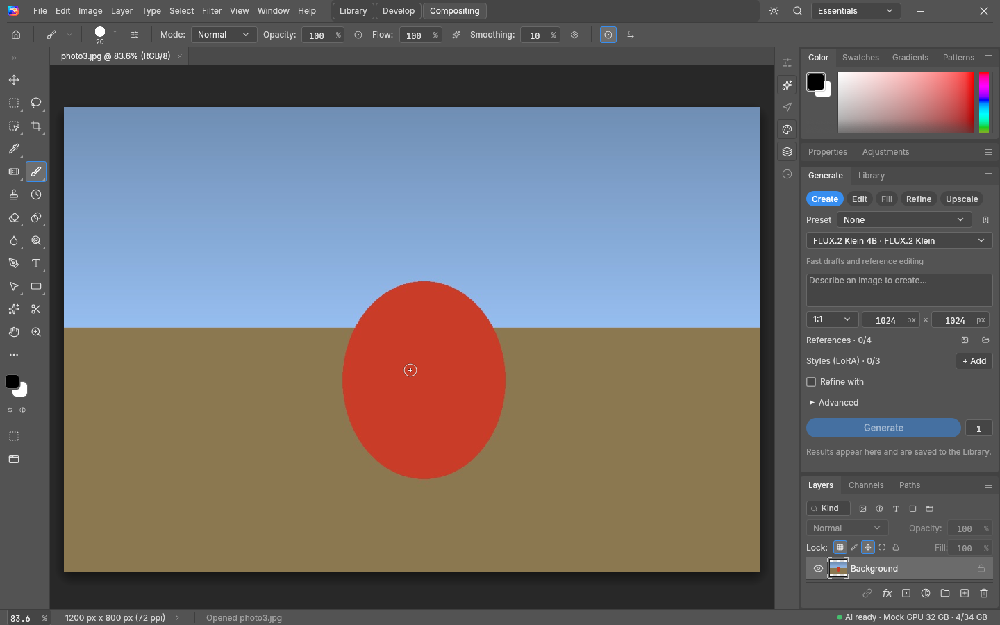
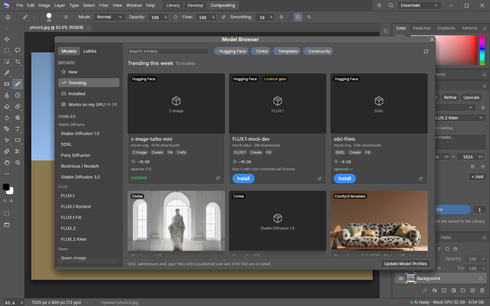

# Local Image 2

**A raster image editor with local AI: retouch, composite, catalogue and generate on your own PC.**

Local Image 2 is a desktop image editor for Linux and Windows, written entirely in Rust. It works the
way Photoshop and Lightroom users expect: tools on the left, panels docked on the right, layers,
masks, adjustment layers, PSD files, camera raw, and a Library mode for cataloguing. The AI features
run on your own GPU through [ComfyUI](https://github.com/comfyanonymous/ComfyUI): no cloud account,
no upload, no per-image bill. The internet is used only when you ask for it (installing models,
checking for updates).

> **This is the V2 branch, for testing before it replaces 0.7.** It builds from source today
> ([build instructions](docs/DEVELOPMENT.md)); the 0.7 installers on the
> [releases page](https://github.com/zdbosoxfan/local-image/releases) are the current stable version.

## What it does

| | |
| --- | --- |
| **Edit** | PhotoCraft's engine: layers and groups, masks, adjustment layers, layer styles, blend modes, smart filters, type, transforms (free, perspective, warp, puppet), Photoshop-style brushes, healing, content-aware fill, selections (marquee, lasso, magic wand, quick selection, Object Selection, Select Subject), 8/16/32-bit colour with ICC management, PSD read and write. |
| **AI tools** | **AI Remove** brush (paint over a distraction), **AI Cutout** (Remove Background with a real alpha matte, refine, add a background), **Generative Fill**, **Generate Background**, **AI Enhance** (SeedVR2), batch background removal. |
| **Generate** | A docked panel, after Krita AI Diffusion: Create, Edit, Fill, Refine and Upscale with any installed model, presets, reference images, LoRAs and Draft → Refine. Results become documents or layers. |
| **Models** | An open, live model system: SD 1.5, SDXL, Pony, Illustrious, SD 3.5, FLUX.1 (Kontext, Fill), FLUX.2 and Klein, Qwen Image and Qwen Edit, Z-Image, ERNIE and HiDream are supported as data files, and installed models are recognised from their weights. The **Model Browser** finds models and LoRAs on Hugging Face, Civitai, ComfyUI's official templates and the ComfyUI-Manager list. |
| **Library** | LightCraft's catalogue as a second mode (**Library ∣ Editor** in the title bar): import, ratings, flags, colour labels, keywords, collections and smart collections, filter bar, compare, sync, export presets, XMP sidecars, and an edit round trip into the editor. |
| **Raw and export** | Camera raw through LightCraft's pipeline (16-bit ProPhoto documents), a filmstrip for folders, and LightCraft's export (JPEG, PNG, TIFF, WebP, AVIF; sizes, sharpening, metadata, presets). |

The full tool-by-tool comparison with GIMP, Krita, Photopea and Compositor, and where each piece
came from, is in [docs/TOOLSET.md](docs/TOOLSET.md). The interface design and the user flows it was
tested against are in [docs/V2-DESIGN.md](docs/V2-DESIGN.md).

## Models

Open **Window › Model Browser…** (or **Browse Models…** in Generate's model picker):

* Browse **New**, **Trending**, **Installed**, **Works on my GPU** or any family, for models or LoRAs.
* Each card shows what the model can do (Create, Edit, Fill, reference images), its download size,
  roughly how much GPU memory it needs and its licence.
* **Install** shows the licence and the exact files first. Every file is checked against its
  published size and SHA-256 and placed in the right ComfyUI folder, and ComfyUI's model list is
  refreshed. Only `.safetensors` and `.gguf` files are installed, and never one without a published
  hash.
* Models from families Local Image doesn't know yet run through ComfyUI's official template with
  basic controls (prompt, seed, size).
* Your own ComfyUI workflows become models too: title nodes `li:prompt`, `li:image`, `li:mask`,
  `li:seed`, `li:output` (and others) and use **Import Workflow…**.
* Gated or sign-in-only models need a Hugging Face token or Civitai API key, set in
  **Edit › Preferences › Local AI…** and sent only to their own site.

| GPU memory | What runs comfortably |
| --- | --- |
| 8 GB | SD 1.5, SDXL, Pony and Illustrious checkpoints |
| 16 GB | Z-Image Turbo, FLUX.2 Klein 4B (and AI Remove), FLUX.1 in FP8 or GGUF |
| 24 GB | Qwen Image (INT8/FP8), FLUX.2 Klein 9B, ERNIE-Image, HiDream in FP8 |
| 32 GB | Qwen Image BF16, SeedVR2 4K enhancement |

Offloading to system memory works but is much slower. The Model Browser's *Works on my GPU* view
filters by the memory ComfyUI reports.

## Getting started

1. Build and run from source: `cargo run --release -p local-image` ([details](docs/DEVELOPMENT.md)).
2. **Edit › Preferences › Local AI…**: detect or choose your ComfyUI installation and start it.
3. Open a photo, a folder (**File › Open Folder…**) or the Library, or type a prompt in **Generate**.

Settings, the generated library and caches live in `~/.local/share/local-image` (Linux) or
`%LOCALAPPDATA%\Local Image` (Windows).

## Licences

Local Image 2 is free software under the **GNU General Public License, version 3 or later**
([LICENSE](LICENSE)). It includes PhotoCraft and LightCraft (MIT or Apache-2.0, see
[licenses/](licenses)), code ported from Krita AI Diffusion (GPL-3.0), and test fixtures from
ComfyUI's workflow templates (MIT); [licenses/model-system-NOTICE.md](licenses/model-system-NOTICE.md)
lists what came from where. Models are separate downloads with their own licences, which the Model
Browser shows before installing; Local Image bundles no model weights and grants no model rights.
