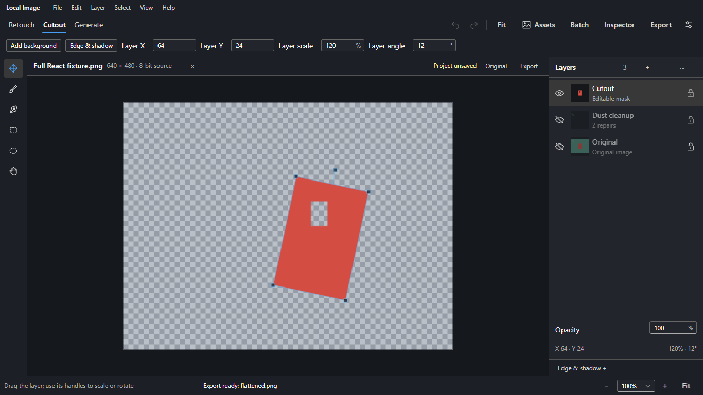
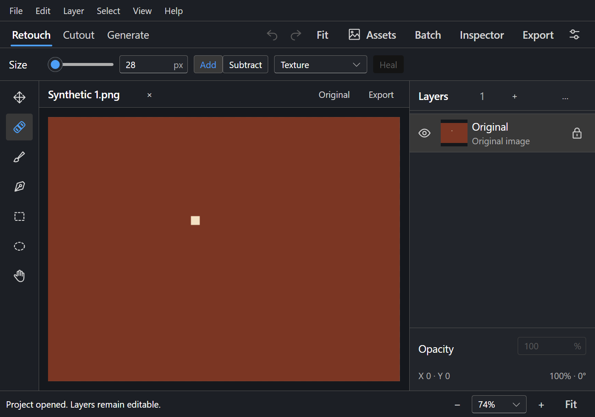
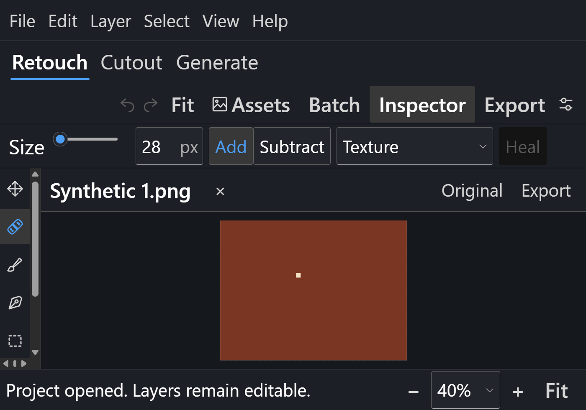
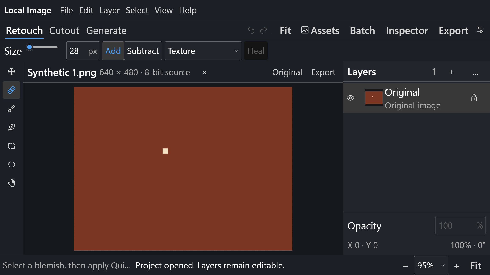
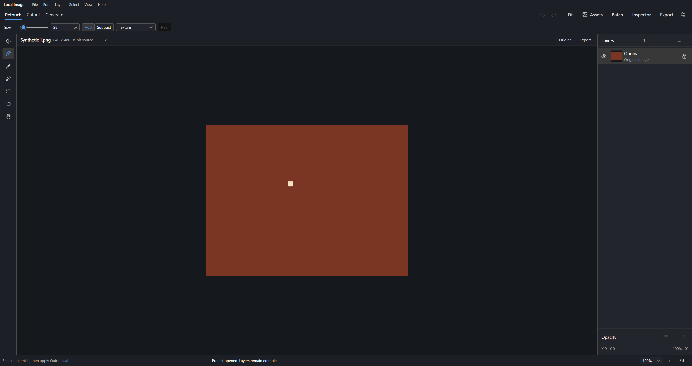

# Full frontend review captures

These five PNG files are genuine screenshots of synthetic QA documents, copied
byte-for-byte from the recorded runs on 2026-09-30. They were not cropped,
resized, retouched, composited or generated for presentation. **No model inference
was executed.** The CIB source-browser image and DC native images show different
documents, saved states, builds and capture environments; they are not equivalent
before/after states.

The source capture used installed headless Edge with the actual isolated Python
backend and exercised real CPU repair, masks, layers and project IO. The native
captures came from the actual packaged WinForms/WebView2 application. Native UI
actions used Computer Use; capture and ownership/geometry helpers only read
state. These native PNGs capture WebView content, not the OS frame or owned file
dialogs.

## Capture identity

| File | Build and environment | CSS viewport / PNG pixels | Recorded state |
| --- | --- | --- | --- |
| [Source project reopened](source-cib-project-reopened-1366x768.png) | Source-browser `CIBtEhRP` JS / `1UhSW1Zf` CSS | 1366 x 768 / 1366 x 768 | Cutout workspace, three-layer edited browser project, selected transformed cutout, two CPU repairs in a separate layer; revision 25, `projectSaved=false`, `projectDirty=true`. A browser download is not native project-save confirmation. |
| [Native small Comfortable](native-dc-800x560-comfortable.png) | Packaged `DCWGvea3` JS / `DrOsjePE` CSS | 800 x 560 / 1400 x 980 | Comfortable density, Inspector visible, reopened saved v3 project. |
| [Native small Large, Inspector hidden](native-dc-800x560-large-inspector-hidden.png) | Packaged `DCWGvea3` JS / `DrOsjePE` CSS | 800 x 560 / 1400 x 980 | Large/200% app text, Inspector hidden so the canvas occupies the available editor height. |
| [Native laptop Large](native-dc-1366x768-large.png) | Packaged `DCWGvea3` JS / `DrOsjePE` CSS | 1366 x 768 / 2391 x 1344 | Large/200% app text, Inspector visible. |
| [Native desktop Comfortable](native-dc-2195x1164-comfortable.png) | Packaged `DCWGvea3` JS / `DrOsjePE` CSS | 2195 x 1164 / 3842 x 2037 | Comfortable density, Inspector visible. |

All four native examples use actual Windows DPI **168**, reported DPR **1.75**;
the PNG raster dimensions therefore differ from their CSS viewport dimensions.
Markdown/image viewers may scale their presentation without changing the PNGs.
Native screenshots retain the same recorded document
`a4721a1e-b6ea-49a5-a25a-a49cc62f23c0`, `Synthetic 1.png`, revision `0`,
`Reviewed v3.lremove`, `projectSaved=true`, `projectDirty=false`, one Original
layer. Layout interactions did not change those recorded metadata fields. This
is not a claim that these captures test every pixel buffer, mask or history state.

The [native size/toggle consolidation](../../qa-artifacts/native-acceptance/full-DCWGvea3/native-size-toggle-consolidation.json)
verifies six exact editor states: 800 x 560, 1366 x 768 and 2195 x 1164 CSS, each
at Comfortable and Large density. The small Large Inspector toggle restored
the canvas from approximately **143 to 275 to 143 CSS px** in height; fit zoom
and pan returned to their prior values. Full opacity controls and transform
summaries were reached by actual wheel input. Near-size attempts (800 x 561 and
1366 x 767) are explicitly excluded, regardless of their filenames.

## SHA-256 and provenance

| File | SHA-256 of both original and copied PNG |
| --- | --- |
| `source-cib-project-reopened-1366x768.png` | `2df4750b75b4b185e0920149d3b737f225a305e0bd451e65a2165c79071bcadd` |
| `native-dc-800x560-comfortable.png` | `84ff835f95cda03872676056eeee65da8568f6a6299edb3e32ffc42b882c94c5` |
| `native-dc-800x560-large-inspector-hidden.png` | `229d24f7e307834361c6e50a2d194bd8766f563820e470570cfc6dee15467914` |
| `native-dc-1366x768-large.png` | `8b19bc8d625a9eef3050799d02af141e5ac771537488c965d02df7ac3a87f277` |
| `native-dc-2195x1164-comfortable.png` | `a37792ad66e3a7f26ffbfd843ad112770749d6951eb17b7a93199d3a840672a8` |

[provenance.json](provenance.json) records every original screenshot/report path,
byte count, raster dimensions, bundle and native executable hashes, and the
associated state. Raw reports are retained under the ignored local
`qa-artifacts/` tree. The native package build is
[staged-DCWGvea3](../../qa-artifacts/native-acceptance/builds/staged-DCWGvea3/result.json);
the source-browser evidence is the
[CIB core run](../../qa-artifacts/migration/final-current-core/results.json).

No UI layout bugs remain known after these inspected repairs. Remaining gates
are Explorer permission/actual drop, actual Capture One GUI handoff, and the
user's final cutover approval. Real argument-path handoff and native save were
tested; they are not represented as Capture One GUI execution. These images do
not certify screen-reader, high-contrast or every DPI configuration. The legacy
default/rollback and superseded sources remain until the required approval;
see [full migration status](../FRONTEND-FULL-MIGRATION.md).

## Review images

Source-browser CIB: reopened edited project at 1366 x 768 CSS.

Native DC: 800 x 560 CSS, Comfortable, Inspector visible.

Native DC: 800 x 560 CSS, Large text, Inspector hidden.

Native DC: 1366 x 768 CSS, Large text.

Native DC: 2195 x 1164 CSS, Comfortable.

